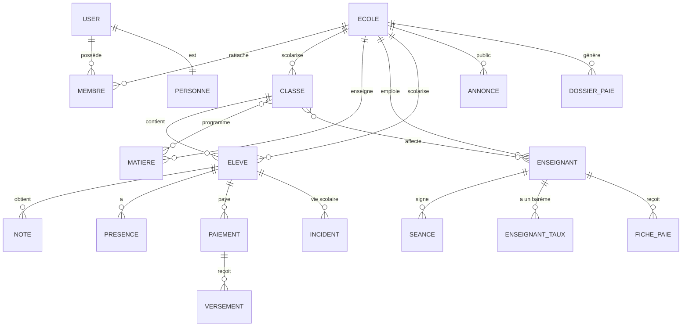

# Rapport de mise à jour — Architecture cible du logiciel scolaire (multi-établissements)

> Document de référence consolidé. Reprend la vision « Un établissement = un espace maître »
> (sections 1–26 condensées), puis ajoute les trois compléments demandés :
> **II. Modèle de données concret**, **III. Rôles & permissions**, **IV. Limites du périmètre MVP**,
> suivis d'une annexe d'audit de l'existant (règle §22 : analyser avant de modifier).

---

## Partie I — Vision consolidée (sections 1–26 du rapport)

1. **Objectif** — Faire évoluer le logiciel existant (ne pas repartir de zéro) vers une plateforme
   gérant plusieurs établissements, en conservant les portails développés.
2. **Principe architectural** — « Un établissement = un espace maître ». Toute donnée scolaire porte
   un `school_id`. Les portails (Élève, Enseignant, Surveillant, Établissement, Réseau scolaire) sont
   cinq interfaces d'un même environnement, selon rôle et permissions.
3. **L'établissement est le centre de contrôle** — élèves, enseignants, surveillants, personnel,
   comptes, classes, matières, affectations, permissions, bulletins, vie scolaire, paiements,
   documents, réseau scolaire. Actions : créer/inviter un utilisateur, accepter un rattachement,
   attribuer un rôle, modifier, suspendre, retirer, gérer classes/affectations, contrôler le réseau.
4. **Portails conservés** — Élève (ses infos), Enseignant (classes/matières/élèves attribués),
   Surveillant (vie scolaire autorisée), Établissement (pilotage), Réseau scolaire (groupes,
   publications, forum, ressources — privé à l'établissement).
5. **Rattachement** — Le compte utilisateur (identité + authentification) est séparé de son
   rattachement à un établissement (`school_id`, rôle, statut, permissions). Un compte non rattaché
   n'accède à aucune donnée d'établissement.
6. **Sécurité multi-établissements** — Isolation stricte A/B (élèves, notes, bulletins, paiements,
   enseignants, salaires, forum, documents, publications) ; protection **backend + base de données**,
   jamais seulement front.
7. **Dossier scolaire unique** — « Un élève = un dossier scolaire unique » : identité, photo,
   matricule, classe, année, responsable, contacts, documents, inscriptions, paiements, reçus, solde,
   évaluations, notes, bulletins, moyennes, rang, appréciations, absences, retards, incidents,
   sanctions, observations, historique.
8. **Une saisie → plusieurs utilisations** — Toute saisie alimente automatiquement les modules
   concernés (administration → dossier → paiement/reçu → classe → enseignant → surveillant → élève).
9. **Exemple de fonctionnement** — Inscription d'un nouvel élève = une seule saisie enrichie ensuite
   par enseignant (notes), surveillant (absences) et administration (paiements) sur le même dossier.
10. **Navigation cible** — Connexion → identification → Établissement (espace maître) → élèves/
    enseignants/surveillants → dossiers scolaires → bulletins/paiements/vie scolaire → réseau scolaire.
11. **Profil élève = porte d'entrée du dossier** — sections visibles selon rôle (vue complète admin,
    vues partielles enseignant/surveillant).
12. **Bulletins progressifs** — Saisie → brouillon → publication → calcul auto → contrôle →
    validation → publication finale. Le surveillant alimente la vie scolaire sans toucher au pédagogique.
13. **Portail surveillant** — présences, absences, retards, incidents, discipline, sanctions,
    observations, rapports (rattachés au dossier élève).
14. **Portail enseignant** — classes autorisées, élèves autorisés, évaluations, saisie/publication des
    notes, éléments bulletins, communication, espaces pédagogiques. **Pas** d'accès aux données
    administratives/financières hors fonction.
15. **Portail établissement** — Accueil, Utilisateurs, Élèves, Enseignants, Surveillants, Personnel,
    Bulletins, Vie scolaire, Finances, Documents, Réseau scolaire, Paramètres (contenu adapté aux
    fonctionnalités déjà présentes).
16. **Réseau scolaire** — privé à l'établissement : groupes de classes, publications, forum, Shorts,
    bibliothèque, documents, notifications. Jamais de mélange entre établissements.
17. **Profils & photos** — photo, profil, rôle, rattachement ; stockage réel ; éviter les copies.
18. **Dossier enseignant/personnel** — identité, photo, matricule, fonction, affectations, contrat,
    documents, salaire, primes, retenues, paiements, historique (logique centralisée).
19. **Finances** — élèves (frais, scolarité, reçus, soldes), personnel (salaire/primes/retenues),
    logiciel (abonnement, factures, échéances).
20. **Historique & traçabilité** — scolaire, paiements, changements, affectations, actions sensibles
    (utilisateur, établissement, date/heure, opération, donnée).
21. **Persistance réelle** — test obligatoire : Créer → Enregistrer → Actualiser → Déconnexion →
    Reconnexion → Vérifier.
22. **Règle absolue** — avant modification : analyser code/BDD/auth/rôles/permissions/routes/portails/
    tables/relations/données persistantes/données mockées/fonctionnalités opérationnelles/problèmes de
    sécurité/fichiers concernés, puis ANALYSER → PLANIFIER → MODIFIER → TESTER → VALIDER. Ne jamais
    supprimer une fonctionnalité fonctionnelle sans justification.
23. **Ordre d'implantation recommandé** — 14 phases (audit → school_id → rattachement → contrôle
    admin → dossier élève → inscription+paiement+documents → bulletins → vie scolaire → historique →
    dossiers personnel+paie → finances → réseau → forum/bibliothèque/Shorts → tests complets).
24. **Nouvel établissement** — créer établissement → school_id → administrateur principal → identité →
    utilisateurs → rôles → classes → utilisation. Une seule plateforme multi-tenant.
25. **Vue d'ensemble** — Établissement A et B isolés sur la même plateforme.
26. **Principe final** — L'établissement est l'espace maître, les portails des interfaces spécialisées,
    le dossier scolaire central, les données saisies une fois et réutilisées selon permissions.

---

## Partie II — Modèle de données concret

### II.1 Règles de modélisation

| # | Règle | Conséquence concrète |
|---|-------|----------------------|
| R1 | Toute donnée « scolaire » est rattachée à exactement un établissement. | Colonne `school_id` NOT NULL sur toutes les tables de domaine. |
| R2 | Les comptes (identité + authentification) sont **globaux** à la plateforme. | Table `users` sans `school_id` ; rattachement porté par une table de jonction. |
| R3 | L'accès aux données est filtré par le `school_id` **de la session** (issu du rattachement), au backend. | Dépendance d'auth fournissant un `contexte {user, membership}` filtrant chaque requête. |
| R4 | Les codes métier (« 3A », « S1 », « T001 », « EL001 »…) restent lisibles mais ne sont uniques **que par établissement**. | Contraintes composites `UniqueConstraint(school_id, code)` au lieu d'un PK code seul. |
| R5 | Chaque table garde une clé primaire surrogat `id` stable ; le code métier reste un attribut d'affichage. | FKs relationnelles sur les PK surrogats (sauf tables purement métier à revisiter). |
| R6 | Une personne physique = une fiche (élève, enseignant, parent, personnel), liée à son compte. | Liaisons `users → personne` conservées, enrichies d'un rattachement. |
| R7 | L'isolation est **doublement vérifiée** : index/contraintes composites + filtre systématique en requête. | Jamais de `SELECT` de domaine sans clause `school_id`. |
| R8 | Toute action sensible est journalisée. | Table `audit_log` (utilisateur, école, date/heure, opération, donnée, avant/après). |

### II.2 Vue d'ensemble (ER cible — périmètre MVP)

### II.3 Tables existantes → cible (migration)

| Table actuelle | Rôle actuel | Changement cible (multi-tenant) | Échéance |
|---|---|---|---|
| `ecole` (singleton, id=1) | établissement | devient la table **établissement** : PK `school_id` ; suppression de la logique singleton (une ligne par école, créée par inscription) | Phase 2 |
| `users` | comptes (email unique) | **inchangée** (globale). `email` reste unique plateforme. Ajout `photo_url` = avatar du compte (une seule copie, §17) | Phase 2/6 |
| *(nouvelle)* `memberships` | — | `(user_id, school_id, role, statut, permissions[], invite_token, invite_expire, cree_le)` ; PK composite `(user_id, school_id)` ; `statut`: actif / invite / suspendu | Phase 3 |
| `classes` | codes « 3A » PK | PK surrogat + `school_id`, `UniqueConstraint(school_id, code)` ; garde `nom/cycle/salle/principal_id` | Phase 2 |
| `matieres` | codes « S1 » PK | idem | Phase 2 |
| `classe_matiere`, `enseignant_classe` | jonctions | ajout `school_id` (cohérence avec les 2 côtés) | Phase 2 |
| `enseignants` | codes « T001 » PK | PK surrogat + `school_id` + code unique par école ; ajout `matricule`, `fonction` (par défaut Enseignant), `photo_url` (photo de profil métier), `contrat` (reporté) | Phase 2/10 |
| `eleves` | codes « EL001 » PK | PK surrogat + `school_id` + `UniqueConstraint(school_id, matricule)` ; `photo_url` (photo d'identité, dossier scolaire) ; **dossier unique** = cette table + agrégats | Phase 2/5 |
| `parents` | fiche parent | `school_id` + `photo_url` ; lien compte | Phase 2 |
| `notes` | pédago | via `eleves`/`matieres` scoping `school_id` (FK composites ou requête jointe) | Phase 2 |
| `presences` | vie scolaire | scoping via `eleves` | Phase 2/8 |
| `paiements`/`versements` | finances élèves | scoping via `eleves` ; ajout `recu_no` (reçu) | Phase 6 |
| `annonces` | communication | `school_id` direct | Phase 2 |
| `enseignant_taux` | barème | scoping via `enseignants` | Phase 10 |
| `seance` | cahier de présence | scoping via `enseignants` | Phase 10 |
| `fiche_paie` | paie | scoping via `enseignants` | Phase 10 |
| `email_codes` | connexion code | globale (plateforme) | — |

> Principe de migration : `school_id` propagé **par niveau de rattachement**. Pour les agrégats
> (`notes`, `presences`, `paiements`, `seance`, `fiche_paie`, `versements`), le rattachement se fait
> par jointure vers la table porteuse (`eleves`, `enseignants`) ; on peut le dénormaliser en colonne
> `school_id` + index composite si le volume le justifie. **Compatibilité `create_all`** : SQLAlchemy
> n'ajoute pas de colonne sur une table existante → script de migration dédié (voir Partie V).

### II.4 Tables à créer dans les phases ultérieures (hors MVP, voir Partie IV)

| Table | Contenu | Phase |
|---|---|---|
| `surveillants` | fiche (réutilise le modèle personnel : id, nom, … `user_id`) | 8 |
| `personnel` | identité, matricule, fonction, contrat | 10 |
| `incidents` / `sanctions` / `observations` / `rapports` | vie scolaire par élève | 8 |
| `bulletins` (en-tête + workflow `statut`) + `bulletin_lignes` | validation progressive | 7 |
| `documents` | métadonnées (élève, type, url stockage) | 6 |
| `historique_eleve` | transitions (classe, statut, année) | 9 |
| `audit_log` | traçabilité (R8) | 2 (léger) |
| `groupes`, `publications`, `messages_forum`, `bibliotheque` | réseau scolaire | 12–13 |

### II.5 Dossier scolaire unique — composition

Le « dossier » de l'élève (report §7) n'est **pas une table géante** mais un **agrégat** construit par
l'API à partir de `eleves` (identité/matricule/classe/**photo**), `parents`, `documents`,
`paiements`/`versements` (solde), `notes` (moyennes/rang via moteur existant), `bulletins`,
`presences`/`incidents` (vie scolaire) et `historique_eleve`. Cette lecture consolidée = endpoint
existant à étendre (`/eleves/{id}` fiche, cf. `app/services/sd.py`) — **aucune ressaisie** (§8).

### II.6 Photos de profil (avatars) — report §17, à ne pas oublier

**Deux niveaux de photo, une seule copie du fichier (règle « pas de copie » §17) :**

| Niveau | Porteur | Usage |
|---|---|---|
| **Avatar de compte** | `users.photo_url` (global) | la personne se représente partout sur la plateforme, y compris hors école |
| **Photo métier d'école** | `eleves.photo_url` (photo d'identité du dossier), `enseignants.photo_url`, `parents.photo_url`, puis `surveillants/personnel` | fiche d'établissement : dossier scolaire, trombinoscope, cahier de texte |

Règles de conception :
- **Stockage** : stockage objet, chemins par école (`{school_id}/avatars/{user_id}.jpg`, `{school_id}/eleves/{matricule}.jpg`) — **jamais de bucket public** ; lecture via URL signée courte ou proxy backend qui vérifie le rattachement (R3/R7).
- **Contraintes d'upload** : JPEG/WebP/PNG ≤ 2 Mo, recadrage carré (512 px), orientation normalisée, nom de fichier généré côté serveur (jamais le nom client), vérification du type réel (pas seulement l'extension).
- **Fallback conservé** : en l'absence de photo, l'existant `SM.avatarHTML` (initiales colorées, `js/ui.js`) reste affiché partout — l'ajout de photo ne casse aucune UI.
- **Droit** : l'utilisateur charge **sa** photo (`users`), l'admin charge les photos des fiches d'école ; jamais d'URL libre saisie par l'utilisateur (le backend stocke, le client reçoit une référence).
- **API cible MVP** : `PUT /mon-profil/photo` (compte), `PUT /eleves/{id}/photo`, `PUT /enseignants/{id}/photo` (admin) → renvoient `photo_url` (cf. brique IV.1-7).

---

## Partie III — Rôles & permissions

### III.1 Trois notions distinctes

| Notion | Définition | Où c'est porté |
|---|---|---|
| **Identité** | personne physique + compte (`users`) | table `users` (globale) |
| **Rôle fonctionnel** | ce que l'utilisateur fait **dans un établissement** | `memberships.role` (rattachement) |
| **Permission** | droit fin (voir/écrire) sur un domaine | MVP : déduite du rôle (matrice ci-dessous) ; plus tard : champ `permissions[]` |

> Conséquence (report §5) : un compte peut exister sans rattachement (aucun accès), ou avoir
> plusieurs rattachements (plusieurs écoles) — un seul actif par défaut à la connexion.

### III.2 Catalogue des rôles

| Rôle | Actuel ? | Périmètre dans l'établissement |
|---|---|---|
| `Administrateur` (direction) | ✅ | Pilotage complet (report §15), gère membres/écoles |
| `Professeur` | ✅ | Classes/matières attribuées, notes, présence/paie personnelle (déjà implémenté) |
| `Surveillant` | ❌ à créer | Vie scolaire uniquement (§13) |
| `Élève` | ✅ | Son dossier, en lecture |
| `Parent` | ✅ | Dossiers de ses enfants, paiements, annonces |
| `Personnel` (compta/autres) | ❌ optionnel | Finances/paie selon permission (report §19) |
| `Super-admin plateforme` | ❌ (interne) | Création de la 1ʳᵉ école, support — jamais de données d'école |

Le `role` actuel du compte (`users.role`, un seul) est **conservé en compatible** mais la source de
vérité devient `memberships.role` (un rôle **par établissement**).

### III.3 Matrice des permissions (périmètre actuel du logiciel)

Légende : ✔ voir · ✚ créer/éditer · ✖ aucune · (auto) limité à soi/à ses enfants/à ses classes

| Domaine | Admin (direction) | Professeur | Surveillant* | Élève | Parent |
|---|---|---|---|---|---|
| Comptes & rattachements de l'école | ✔✚ (suspendre/retirer) | ✖ | ✖ | ✖ | ✖ |
| Élèves (référentiel + dossier) | ✔✚ | ✔ (classes attribuées) | ✔ (listes vie scol.) | ✔ (auto) | ✔ (enfants) |
| Classes / matières / affectations | ✔✚ | ✔ (attribuées) | ✖ | ✔ (sa classe) | ✖ |
| Notes & évaluations | ✔✚ (contrôle) | ✔✚ (sa matière) | ✖ | ✔ (résultats) | ✔ (enfants) |
| Bulletins (workflow §12) | ✔✚ (publier/valider) | ✔ (saisie, avant publication) | ✖ | ✔ | ✔ |
| Présences (journal de classe) | ✔ | ✔ (ses séances) | ✔✚ | ✖ | ✔ (enfants) |
| Vie scolaire : incidents/sanctions | ✔ | ✖ | ✔✚ | ✖ | ✔ (enfants) |
| Paiements élèves & reçus | ✔✚ | ✖ | ✖ | ✔ (auto) | ✔ (enfants) |
| Rémunérations & paie | ✔✚ (barèmes, fiches) | ✔ (ma fiche, consultation) | ✖ | ✖ | ✖ |
| Annonces | ✔✚ | ✔ | ✔ | ✔ | ✔ |
| Réseau scolaire de l'école | ✔✚ (modération) | ✔ (ses groupes) | ✔ (autorisé) | ✔ | ✔ (selon groupes) |
| Paramètres de l'école | ✔✚ | ✖ | ✖ | ✖ | ✖ |

*Surveillant : rôle nouveau, ajouté sans casser l'existant (cf. Phase 8).

### III.4 Règles transverses

1. **Toute requête de domaine porte le `school_id` du rattachement actif** — vérifié par dépendance
   backend (dépasse `require_roles`, qui ne vérifie que le rôle global).
2. Règles « auto » existantes conservées : élève → lui-même (`users.eleve_id`), parent → ses enfants
   (`users.parent_id`), professeur → sa matière (`users.enseignant_id` → `matiere_id`) et son espace
   paie (`/mon-espace/*`).
3. Un `Administrateur` d'une école n'est jamais administrateur d'une autre (rattachement distinct).
4. Frontend : menus déjà filtrés par rôle (`js/ui.js` `p.roles`) — compléter par le rattachement actif.
5. Isolation validée par des **tests dédiés** (deux écoles, cross-tenant 403/404/404, cf. Partie V).

---

## Partie IV — Périmètre MVP & limites

### IV.1 Dans le périmètre MVP (prochaines itérations)

| # | Brique | Contenu minimal accepté |
|---|--------|--------------------------|
| 1 | **Isolation `school_id`** | Colonne + filtrage backend/DB sur les tables existantes ; suppression du singleton `ecole` ; inscriptions d'écoles multiples ; tests cross-tenant |
| 2 | **Rattachement** | `memberships` (user × school × role × statut) ; invitation par email + acceptation ; suspendre/retirer ; rôle par établissement |
| 3 | **Portail établissement élargi** | Gestion des membres (comptes existants réutilisés), des affectations, contrôle des accès |
| 4 | **Portail Surveillant** | Vie scolaire (présences → incidents/sanctions/observations) sur les élèves autorisés |
| 5 | **Dossier élève consolidé** | Fiche agrégée (déjà en partie servie par `/eleves/{id}`) : + documents (métadonnées) + historique annuel |
| 6 | **Finances** | Reçus numérotés par école ; soldes ; (paie déjà en place, à scoper par école) |
| 7 | **Photos de profil (avatars)** | Upload recadré ≤ 2 Mo sur stockage objet par école ; `photo_url` sur `users` + fiches élèves/enseignants/parents (II.6) ; fallback initiales conservé (`SM.avatarHTML`) |
| 8 | **Persistance & traçabilité** | Règle §21 systématique ; `audit_log` léger sur actions sensibles |

### IV.2 Hors périmètre MVP (différé explicitement)

| Sujet | Raison |
|---|---|
| Réseau scolaire social (groupes/publications/forum/Shorts/bibliothèque) | Rien n'existe aujourd'hui ; à bâtir après l'isolation (Phases 12–13) |
| Documents volumineux du dossier (pièces, contrats, bulletins PDF) & galerie d'établissement | Nécessite règles par école + volumétrie ; **les photos de profil restent DANS le MVP** (brique 7) |
| Multi-devises / multi-cycles d'études paramétrables | Contexte actuel : FCFA, Collège/Lycée ; à généraliser plus tard |
| Contrats & paie complexe du personnel (primes, retenues, congés) | Le module vacation (taux × heures) est le cas réel actuel ; extensions en Phase 10+ |
| Super-admin / back-office plateforme (facturation abonnements) | Non requis pour la mise en service multi-écoles |
| Application mobile native | Web responsive conservé |
| Synchronisation offline | Hors sujet plateforme |

### IV.3 Critères de « fait » pour chaque brique MVP

- Backend : isolation prouvée par tests automatiques **cross-tenant** (école A ne voit jamais B) ;
- Persistance : le test §21 passe pour chaque écriture (créer → recharger → déconnecter → reconnecter) ;
- Aucune fonctionnalité existante supprimée sans justification (règle §22) ;
- Suite pytest complète verte + E2E navigateur (méthodologie déjà en place).

---

## Partie V — Plan d'implantation immédiat (détail Phase 1–3)

**Phase 1 — Audit** : voir annexe ; livrable = cartographie + cette matrice de migration.

**Phase 2 — `school_id`** (la plus structurante) :
1. Migration DB dédiée (pas `create_all` seul) : script `_migrate_school_id.py` — ajoute `school_id`,
   bascule des PK codes vers PK surrogats + contraintes uniques composites **sans perte des codes
   métier**, affecte `school_id = 1` aux lignes existantes (l'école actuelle), puis rend `NOT NULL`.
2. Backend : contexte de requête `{user, membership}` ; filtre `school_id` ajouté aux requêtes de
   domaine (référentiel, élèves, notes, présences, paiements, annonces, paie) ; les routes publiques
   sans auth (classes/matieres en lecture) deviennent scopées par établissement ou documentées.
   ✅ **fait** — les 10 lectures de domaine exigent un jeton et le repli ambigu est supprimé (§ V.2).
3. Tests : suite existante maintenue verte + nouveau `test_multitenant.py` (2 écoles, isolation).
   ✅ **fait** — suite **82/82 verte** (`test_multitenant.py` = 6 tests, 2 écoles, codes métier identiques).
4. E2E local sur base de démo à 2 écoles, puis déploiement prod (aucune donnée perdue).
   ✅ **Étape locale faite (2026-09-10)** — base jetable à 2 écoles, isolation vérifiée en API *et* dans
   le navigateur (voir § V.1). ⏳ **Déploiement prod = non fait** : la prod PG (« saint collete »,
   données réelles) n'est **pas** migrée ; les commits Phase 2 restent locaux.

### V.1 État réel de la Phase 2 au 2026-09-10

| Élément | État |
| --- | --- |
| Modèles `(school_id, id)` + FKs composites | ✅ codé (commit `dd7de33`) |
| Routeurs scopés + middleware de contexte école | ✅ codé |
| Fermeture de la faille « repli silencieux sur l'école n° 1 » | ✅ codé (2026-09-10, § V.2) — 14 → 4 routes non refusées |
| `test_multitenant.py` (6 tests) | ✅ vert |
| Migration des bases SQLite existantes | ✅ script `backend/_migrate_school_id.py` (commit `aeeea82`) — **dev seulement** |
| Base dev `backend/data/school.db` migrée (école 1) | ✅ counts identiques, `integrity_check ok`, sauvegarde `.bak-20260910-003311` |
| E2E local 2 écoles (API + navigateur) | ✅ validé |
| Migration prod PG Supabase | ❌ **non faite** — chemin PG / Alembic à prévoir |
| `memberships` (Phase 3) | ❌ non commencé |
| Photos de profil (brique 7) | ❌ non commencé |

> ⚠️ **Ne pas pousser `dd7de33` / `aeeea82` en l'état** : la prod PG n'ayant pas la colonne `school_id`,
> le déploiement provoquerait `no such column: school_id` sur toutes les routes de domaine.

### V.2 Fermeture de la faille « repli silencieux sur l'école n° 1 » (2026-09-10)

**Constat (audit automatisé des 44 routes).** 10 lectures de domaine et la sonde `/health`
répondaient **200 sans jeton** : `GET /classes`, `/classes/{id}`, `/classes/{id}/emploi-du-temps`,
`/matieres`, `/enseignants`, `/enseignants/{id}`, `/ecole`, `/annonces`, `/dashboard`,
`/paiements/stats`. Comme `sd._sid()` retombait sur « la première école de la base », un simple appel
anonyme lisait les données de l'école n° 1 : l'isolation de la Phase 2 devenait **illusoire** dès
qu'une deuxième école réelle existerait.

| Correctif | Détail |
| --- | --- |
| Lectures de domaine protégées | `get_current_user` (tout compte de l'école) sur les 10 routes ci-dessus ; écritures déjà en `require_roles(ROLE_ADMIN)`, inchangées |
| Repli « école n° 1 » supprimé | `sd._sid()` n'admet plus le repli que s'il est **non ambigu** (au plus une école en base) ; sinon `sd.EcoleIndeterminee` — échec explicite au lieu d'une fuite silencieuse |
| `/health` assainie | Sans jeton : `counts = null` et `ecole = null` (le nom de l'établissement n'est plus divulgué) |
| Résolveur non strict dédié | Nouveau `sd.ecole_principale()` pour les **routes publiques** (inscription Parent, inscription établissement, libellé école au login) : rattachement explicite à l'école de déploiement, sans jamais introduire de 500 sur une route publique |
| Inscription Parent rattachée | `POST /auth/inscription` renseigne désormais `school_id` (auparavant `NULL`, ce qui rendait le compte inutilisable dès la 2ᵉ école avec un contexte fail-closed) |
| Garde-fou automatisé | Nouveau `backend/tests/test_isolation_routes.py` : 401 sans jeton **et** 200 avec jeton sur les 10 routes, `/health` anonyme vide, priorité du contexte explicite, repli refusé dès 2 écoles |

**Vérification.** Même audit rejoué avant/après sur les 44 routes : **14 → 4** réponses non refusées.
Les 4 restantes sont publiques **par nature** : `/auth/options`, `/auth/google`,
`/auth/google/callback` et `/health` (désormais sans aucune donnée d'établissement).
Suite complète : **105 tests verts** (82 + 23 nouveaux).

**Phase 3 — Rattachement** : `memberships`, invitations, `role` par école, UI « 👥 Utilisateurs »
dans le portail établissement (réutilise `GET/POST /auth/comptes` actuels).

> ⚠️ Décisions à trancher avant implémentation (voir questions posées au propriétaire).

---

## Annexe — Audit de l'existant (règle §22, état 2026-09-09)

### A.1 Base de données (SQLAlchemy, SQLite en local / PostgreSQL Supabase en prod)

Tables actuelles : `ecole` (singleton), `matieres` (PK code « S1 »), `classes` (PK code « 3A »),
`classe_matiere`, `enseignant_classe`, `enseignants` (PK « T001 », `matiere_id`, `statut`), `parents`,
`eleves` (PK « EL001 », `classe_id`, `statut`, `inscription`, `parent_id`), `notes`
(`uq eleve/matiere/eval`), `presences`, `paiements`, `versements`, `annonces` (PK « A1 »), `users`
(email unique, role, actif, liaisons `eleve_id`/`enseignant_id`/`parent_id`), `email_codes`,
`enseignant_taux`, `seance` (cahier de présence), `fiche_paie` (paie). **Aucun champ photo en base** :
l'UI affiche uniquement des avatars à initiales (`SM.avatarHTML`, `js/ui.js`) — état de départ pour
la brique « photos de profil » (IV.1-7).

### A.2 Authentification, rôles, permissions

- JWT Bearer (`get_current_user`) ; `require_roles(Administrateur, Professeur, Élève, Parent)`.
- Aucun rôle `Surveillant` ni concept de « personnel » pour l'instant.
- Scoping actuel : élève→lui-même, parent→ses enfants, prof→sa matière (+ son `enseignant_id` pour
  `/mon-espace/*` et paie) ; **pas de `school_id`** (architecture mono-école de fait).
- `POST /auth/inscription-etablissement` : crée l'école **si la table est vide** (début de multi-tenant).

### A.3 Routers (`/api/v1`)

`auth`, `dashboard`, `ecole`, `eleves`, `etat`, `referentiel` (classes/matieres/ecole CRUD),
`pedagogie` (notes), `presences`, `paiements`, `paie` (mon-espace + rémunérations). Front vanilla ES5,
pages `/pages/*`, état via `GET /etat` → `window.SD` (mode API). Suite pytest : **76 tests verts**.

### A.4 Points d'attention sécurité (⚠️ historique — **résolu** le 2026-09-10, voir § V.2)

Endpoints **sans authentification** (seulement `get_db`) à scoper par établissement :
- `GET /dashboard` (agrégats) et `GET /paiements/stats` (synthèse financière) ;
- lectures publiques du référentiel : `GET /classes`, `GET /classes/{id}`, `GET /classes/{id}/emploi-du-temps`,
  `GET /matieres`, `GET /enseignants`, `GET /enseignants/{id}`, `GET /ecole`, `GET /annonces`
  (lectures utilisées par le front en mode non connecté — à passer en lecture scopée ou protégée) ;
- `GET /etat` est au contraire **protégé** (auth requise) ✅.

> **État final (Phase 2)** : ces 10 routes exigent désormais un jeton et `sd._sid()` refuse tout repli
> ambigu. Seuls restent publics `/auth/*` (connexion / inscription) et `/health` (sans données
> d'établissement). Détail des correctifs et preuves : § V.2.

Autres points :
- Codes métier PK (collisions inter-écoles possibles en multi-tenant) — résolu par R4/R5.
- Aucune route de suppression de compte (`/auth/comptes` GET/POST seulement).
