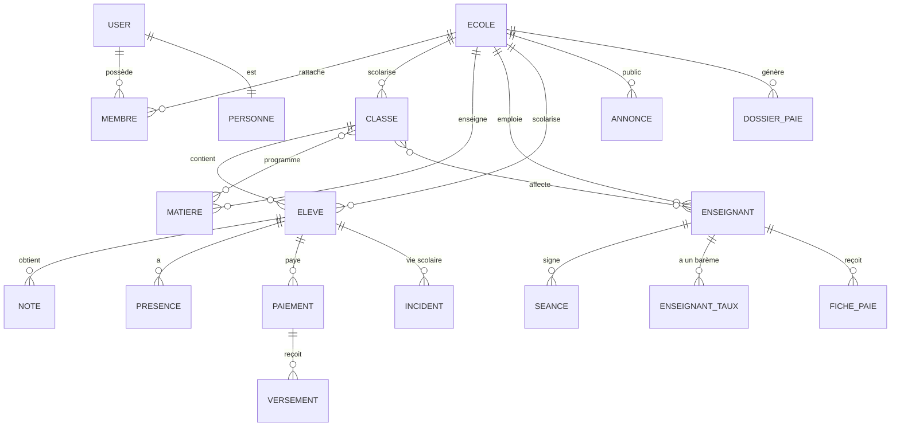
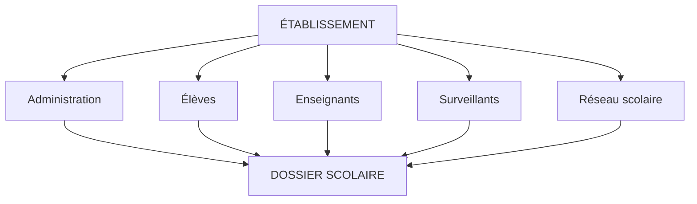
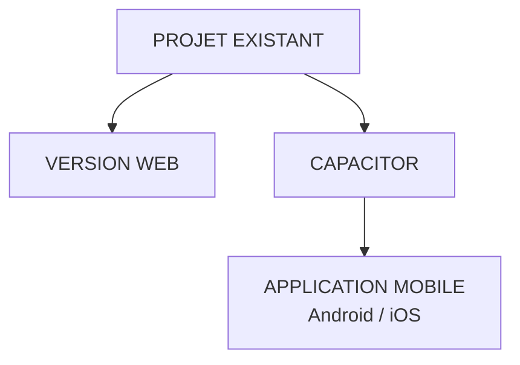
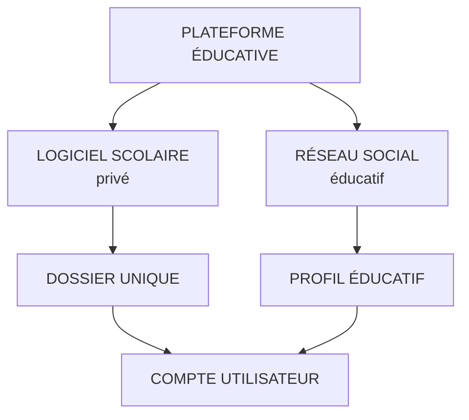

# Rapport de mise à jour — Architecture cible du logiciel scolaire (multi-établissements)

> Document de référence consolidé. Reprend la vision « Un établissement = un espace maître »
> (sections 1–26 condensées), puis ajoute les trois compléments demandés :
> **II. Modèle de données concret**, **III. Rôles & permissions**, **IV. Limites du périmètre MVP**,
> suivis d'une annexe d'audit de l'existant (règle §22 : analyser avant de modifier).
>
> **Complément du 2026-09-10 — chaîne complète du parcours éducatif.** La vision du propriétaire
> couvre désormais le parcours entier, de l'inscription au réseau social éducatif, et impose deux
> règles techniques : *un dossier scolaire unique alimenté une seule fois*, et *la version mobile
> s'obtient par adaptation + couche native (Capacitor) du projet existant, jamais par reconstruction*.
> Ce complément ajoute :
> **VI. Chaîne complète du parcours** · **VII. Frontières des données** ·
> **VIII. États et responsables** · **IX. MVP clairement délimité** · **X. Écarts constatés (audit)**.
>
> **Statut des paliers au 2026-09-10** : MVP-1 (socle multi-établissements) **fait et en production** ;
> le reste est planifié ci-dessous (Partie IX).

---

## Partie I — Vision consolidée (sections 1–26 du rapport)

1. **Objectif** — Faire évoluer le logiciel existant (ne pas repartir de zéro) vers une plateforme
   gérant plusieurs établissements, en conservant les portails développés.
2. **Principe architectural** — « Un établissement = un espace maître ». Toute donnée scolaire porte
   un `school_id`. Les portails (Élève, Enseignant, Surveillant, Établissement, Réseau scolaire) sont
   cinq interfaces d'un même environnement, selon rôle et permissions.
3. **L'établissement est le centre de contrôle** — élèves, enseignants, surveillants, personnel,
   comptes, classes, matières, affectations, permissions, bulletins, vie scolaire, paiements,
   documents, réseau scolaire. Actions : créer/inviter un utilisateur, accepter un rattachement,
   attribuer un rôle, modifier, suspendre, retirer, gérer classes/affectations, contrôler le réseau.
4. **Portails conservés** — Élève (ses infos), Enseignant (classes/matières/élèves attribués),
   Surveillant (vie scolaire autorisée), Établissement (pilotage), Réseau scolaire (groupes,
   publications, forum, ressources — privé à l'établissement).
5. **Rattachement** — Le compte utilisateur (identité + authentification) est séparé de son
   rattachement à un établissement (`school_id`, rôle, statut, permissions). Un compte non rattaché
   n'accède à aucune donnée d'établissement.
6. **Sécurité multi-établissements** — Isolation stricte A/B (élèves, notes, bulletins, paiements,
   enseignants, salaires, forum, documents, publications) ; protection **backend + base de données**,
   jamais seulement front.
7. **Dossier scolaire unique** — « Un élève = un dossier scolaire unique » : identité, photo,
   matricule, classe, année, responsable, contacts, documents, inscriptions, paiements, reçus, solde,
   évaluations, notes, bulletins, moyennes, rang, appréciations, absences, retards, incidents,
   sanctions, observations, historique.
8. **Une saisie → plusieurs utilisations** — Toute saisie alimente automatiquement les modules
   concernés (administration → dossier → paiement/reçu → classe → enseignant → surveillant → élève).
9. **Exemple de fonctionnement** — Inscription d'un nouvel élève = une seule saisie enrichie ensuite
   par enseignant (notes), surveillant (absences) et administration (paiements) sur le même dossier.
10. **Navigation cible** — Connexion → identification → Établissement (espace maître) → élèves/
    enseignants/surveillants → dossiers scolaires → bulletins/paiements/vie scolaire → réseau scolaire.
11. **Profil élève = porte d'entrée du dossier** — sections visibles selon rôle (vue complète admin,
    vues partielles enseignant/surveillant).
12. **Bulletins progressifs** — Saisie → brouillon → publication → calcul auto → contrôle →
    validation → publication finale. Le surveillant alimente la vie scolaire sans toucher au pédagogique.
13. **Portail surveillant** — présences, absences, retards, incidents, discipline, sanctions,
    observations, rapports (rattachés au dossier élève).
14. **Portail enseignant** — classes autorisées, élèves autorisés, évaluations, saisie/publication des
    notes, éléments bulletins, communication, espaces pédagogiques. **Pas** d'accès aux données
    administratives/financières hors fonction.
15. **Portail établissement** — Accueil, Utilisateurs, Élèves, Enseignants, Surveillants, Personnel,
    Bulletins, Vie scolaire, Finances, Documents, Réseau scolaire, Paramètres (contenu adapté aux
    fonctionnalités déjà présentes).
16. **Réseau scolaire** — privé à l'établissement : groupes de classes, publications, forum, Shorts,
    bibliothèque, documents, notifications. Jamais de mélange entre établissements.
17. **Profils & photos** — photo, profil, rôle, rattachement ; stockage réel ; éviter les copies.
18. **Dossier enseignant/personnel** — identité, photo, matricule, fonction, affectations, contrat,
    documents, salaire, primes, retenues, paiements, historique (logique centralisée).
19. **Finances** — élèves (frais, scolarité, reçus, soldes), personnel (salaire/primes/retenues),
    logiciel (abonnement, factures, échéances).
20. **Historique & traçabilité** — scolaire, paiements, changements, affectations, actions sensibles
    (utilisateur, établissement, date/heure, opération, donnée).
21. **Persistance réelle** — test obligatoire : Créer → Enregistrer → Actualiser → Déconnexion →
    Reconnexion → Vérifier.
22. **Règle absolue** — avant modification : analyser code/BDD/auth/rôles/permissions/routes/portails/
    tables/relations/données persistantes/données mockées/fonctionnalités opérationnelles/problèmes de
    sécurité/fichiers concernés, puis ANALYSER → PLANIFIER → MODIFIER → TESTER → VALIDER. Ne jamais
    supprimer une fonctionnalité fonctionnelle sans justification.
23. **Ordre d'implantation recommandé** — 14 phases (audit → school_id → rattachement → contrôle
    admin → dossier élève → inscription+paiement+documents → bulletins → vie scolaire → historique →
    dossiers personnel+paie → finances → réseau → forum/bibliothèque/Shorts → tests complets).
24. **Nouvel établissement** — créer établissement → school_id → administrateur principal → identité →
    utilisateurs → rôles → classes → utilisation. Une seule plateforme multi-tenant.
25. **Vue d'ensemble** — Établissement A et B isolés sur la même plateforme.
26. **Principe final** — L'établissement est l'espace maître, les portails des interfaces spécialisées,
    le dossier scolaire central, les données saisies une fois et réutilisées selon permissions.

---

## Partie II — Modèle de données concret

### II.1 Règles de modélisation

| # | Règle | Conséquence concrète |
|---|-------|----------------------|
| R1 | Toute donnée « scolaire » est rattachée à exactement un établissement. | Colonne `school_id` NOT NULL sur toutes les tables de domaine. |
| R2 | Les comptes (identité + authentification) sont **globaux** à la plateforme. | Table `users` sans `school_id` ; rattachement porté par une table de jonction. |
| R3 | L'accès aux données est filtré par le `school_id` **de la session** (issu du rattachement), au backend. | Dépendance d'auth fournissant un `contexte {user, membership}` filtrant chaque requête. |
| R4 | Les codes métier (« 3A », « S1 », « T001 », « EL001 »…) restent lisibles mais ne sont uniques **que par établissement**. | Contraintes composites `UniqueConstraint(school_id, code)` au lieu d'un PK code seul. |
| R5 | Chaque table garde une clé primaire surrogat `id` stable ; le code métier reste un attribut d'affichage. | FKs relationnelles sur les PK surrogats (sauf tables purement métier à revisiter). |
| R6 | Une personne physique = une fiche (élève, enseignant, parent, personnel), liée à son compte. | Liaisons `users → personne` conservées, enrichies d'un rattachement. |
| R7 | L'isolation est **doublement vérifiée** : index/contraintes composites + filtre systématique en requête. | Jamais de `SELECT` de domaine sans clause `school_id`. |
| R8 | Toute action sensible est journalisée. | Table `audit_log` (utilisateur, école, date/heure, opération, donnée, avant/après). |

### II.2 Vue d'ensemble (ER cible — périmètre MVP)



### II.3 Tables existantes → cible (migration)

| Table actuelle | Rôle actuel | Changement cible (multi-tenant) | Échéance |
|---|---|---|---|
| `ecole` (singleton, id=1) | établissement | devient la table **établissement** : PK `school_id` ; suppression de la logique singleton (une ligne par école, créée par inscription) | Phase 2 |
| `users` | comptes (email unique) | **inchangée** (globale). `email` reste unique plateforme. Ajout `photo_url` = avatar du compte (une seule copie, §17) | Phase 2/6 |
| *(nouvelle)* `memberships` | — | `(user_id, school_id, role, statut, permissions[], invite_token, invite_expire, cree_le)` ; PK composite `(user_id, school_id)` ; `statut`: actif / invite / suspendu | Phase 3 |
| `classes` | codes « 3A » PK | PK surrogat + `school_id`, `UniqueConstraint(school_id, code)` ; garde `nom/cycle/salle/principal_id` | Phase 2 |
| `matieres` | codes « S1 » PK | idem | Phase 2 |
| `classe_matiere`, `enseignant_classe` | jonctions | ajout `school_id` (cohérence avec les 2 côtés) | Phase 2 |
| `enseignants` | codes « T001 » PK | PK surrogat + `school_id` + code unique par école ; ajout `matricule`, `fonction` (par défaut Enseignant), `photo_url` (photo de profil métier), `contrat` (reporté) | Phase 2/10 |
| `eleves` | codes « EL001 » PK | PK surrogat + `school_id` + `UniqueConstraint(school_id, matricule)` ; `photo_url` (photo d'identité, dossier scolaire) ; **dossier unique** = cette table + agrégats | Phase 2/5 |
| `parents` | fiche parent | `school_id` + `photo_url` ; lien compte | Phase 2 |
| `notes` | pédago | via `eleves`/`matieres` scoping `school_id` (FK composites ou requête jointe) | Phase 2 |
| `presences` | vie scolaire | scoping via `eleves` | Phase 2/8 |
| `paiements`/`versements` | finances élèves | scoping via `eleves` ; ajout `recu_no` (reçu) | Phase 6 |
| `annonces` | communication | `school_id` direct | Phase 2 |
| `enseignant_taux` | barème | scoping via `enseignants` | Phase 10 |
| `seance` | cahier de présence | scoping via `enseignants` | Phase 10 |
| `fiche_paie` | paie | scoping via `enseignants` | Phase 10 |
| `email_codes` | connexion code | globale (plateforme) | — |

> Principe de migration : `school_id` propagé **par niveau de rattachement**. Pour les agrégats
> (`notes`, `presences`, `paiements`, `seance`, `fiche_paie`, `versements`), le rattachement se fait
> par jointure vers la table porteuse (`eleves`, `enseignants`) ; on peut le dénormaliser en colonne
> `school_id` + index composite si le volume le justifie. **Compatibilité `create_all`** : SQLAlchemy
> n'ajoute pas de colonne sur une table existante → script de migration dédié (voir Partie V).

### II.4 Tables à créer dans les phases ultérieures (hors MVP, voir Partie IV)

| Table | Contenu | Phase |
|---|---|---|
| `surveillants` | fiche (réutilise le modèle personnel : id, nom, … `user_id`) | 8 |
| `personnel` | identité, matricule, fonction, contrat | 10 |
| `incidents` / `sanctions` / `observations` / `rapports` | vie scolaire par élève | 8 |
| `bulletins` (en-tête + workflow `statut`) + `bulletin_lignes` | validation progressive | 7 |
| `documents` | métadonnées (élève, type, url stockage) | 6 |
| `historique_eleve` | transitions (classe, statut, année) | 9 |
| `audit_log` | traçabilité (R8) | 2 (léger) |
| `groupes`, `publications`, `messages_forum`, `bibliotheque` | réseau scolaire | 12–13 |

### II.5 Dossier scolaire unique — composition

Le « dossier » de l'élève (report §7) n'est **pas une table géante** mais un **agrégat** construit par
l'API à partir de `eleves` (identité/matricule/classe/**photo**), `parents`, `documents`,
`paiements`/`versements` (solde), `notes` (moyennes/rang via moteur existant), `bulletins`,
`presences`/`incidents` (vie scolaire) et `historique_eleve`. Cette lecture consolidée = endpoint
existant à étendre (`/eleves/{id}` fiche, cf. `app/services/sd.py`) — **aucune ressaisie** (§8).

### II.6 Photos de profil (avatars) — report §17, à ne pas oublier

**Deux niveaux de photo, une seule copie du fichier (règle « pas de copie » §17) :**

| Niveau | Porteur | Usage |
|---|---|---|
| **Avatar de compte** | `users.photo_url` (global) | la personne se représente partout sur la plateforme, y compris hors école |
| **Photo métier d'école** | `eleves.photo_url` (photo d'identité du dossier), `enseignants.photo_url`, `parents.photo_url`, puis `surveillants/personnel` | fiche d'établissement : dossier scolaire, trombinoscope, cahier de texte |

Règles de conception :
- **Stockage** : stockage objet, chemins par école (`{school_id}/avatars/{user_id}.jpg`, `{school_id}/eleves/{matricule}.jpg`) — **jamais de bucket public** ; lecture via URL signée courte ou proxy backend qui vérifie le rattachement (R3/R7).
- **Contraintes d'upload** : JPEG/WebP/PNG ≤ 2 Mo, recadrage carré (512 px), orientation normalisée, nom de fichier généré côté serveur (jamais le nom client), vérification du type réel (pas seulement l'extension).
- **Fallback conservé** : en l'absence de photo, l'existant `SM.avatarHTML` (initiales colorées, `js/ui.js`) reste affiché partout — l'ajout de photo ne casse aucune UI.
- **Droit** : l'utilisateur charge **sa** photo (`users`), l'admin charge les photos des fiches d'école ; jamais d'URL libre saisie par l'utilisateur (le backend stocke, le client reçoit une référence).
- **API cible MVP** : `PUT /mon-profil/photo` (compte), `PUT /eleves/{id}/photo`, `PUT /enseignants/{id}/photo` (admin) → renvoient `photo_url` (cf. brique IV.1-7).

---

## Partie III — Rôles & permissions

### III.1 Trois notions distinctes

| Notion | Définition | Où c'est porté |
|---|---|---|
| **Identité** | personne physique + compte (`users`) | table `users` (globale) |
| **Rôle fonctionnel** | ce que l'utilisateur fait **dans un établissement** | `memberships.role` (rattachement) |
| **Permission** | droit fin (voir/écrire) sur un domaine | MVP : déduite du rôle (matrice ci-dessous) ; plus tard : champ `permissions[]` |

> Conséquence (report §5) : un compte peut exister sans rattachement (aucun accès), ou avoir
> plusieurs rattachements (plusieurs écoles) — un seul actif par défaut à la connexion.

### III.2 Catalogue des rôles

| Rôle | Actuel ? | Périmètre dans l'établissement |
|---|---|---|
| `Administrateur` (direction) | ✅ | Pilotage complet (report §15), gère membres/écoles |
| `Professeur` | ✅ | Classes/matières attribuées, notes, présence/paie personnelle (déjà implémenté) |
| `Surveillant` | ❌ à créer | Vie scolaire uniquement (§13) |
| `Élève` | ✅ | Son dossier, en lecture |
| `Parent` | ✅ | Dossiers de ses enfants, paiements, annonces |
| `Personnel` (compta/autres) | ❌ optionnel | Finances/paie selon permission (report §19) |
| `Super-admin plateforme` | ❌ (interne) | Création de la 1ʳᵉ école, support — jamais de données d'école |

Le `role` actuel du compte (`users.role`, un seul) est **conservé en compatible** mais la source de
vérité devient `memberships.role` (un rôle **par établissement**).

### III.3 Matrice des permissions (périmètre actuel du logiciel)

Légende : ✔ voir · ✚ créer/éditer · ✖ aucune · (auto) limité à soi/à ses enfants/à ses classes

| Domaine | Admin (direction) | Professeur | Surveillant* | Élève | Parent |
|---|---|---|---|---|---|
| Comptes & rattachements de l'école | ✔✚ (suspendre/retirer) | ✖ | ✖ | ✖ | ✖ |
| Élèves (référentiel + dossier) | ✔✚ | ✔ (classes attribuées) | ✔ (listes vie scol.) | ✔ (auto) | ✔ (enfants) |
| Classes / matières / affectations | ✔✚ | ✔ (attribuées) | ✖ | ✔ (sa classe) | ✖ |
| Notes & évaluations | ✔✚ (contrôle) | ✔✚ (sa matière) | ✖ | ✔ (résultats) | ✔ (enfants) |
| Bulletins (workflow §12) | ✔✚ (publier/valider) | ✔ (saisie, avant publication) | ✖ | ✔ | ✔ |
| Présences (journal de classe) | ✔ | ✔ (ses séances) | ✔✚ | ✖ | ✔ (enfants) |
| Vie scolaire : incidents/sanctions | ✔ | ✖ | ✔✚ | ✖ | ✔ (enfants) |
| Paiements élèves & reçus | ✔✚ | ✖ | ✖ | ✔ (auto) | ✔ (enfants) |
| Rémunérations & paie | ✔✚ (barèmes, fiches) | ✔ (ma fiche, consultation) | ✖ | ✖ | ✖ |
| Annonces | ✔✚ | ✔ | ✔ | ✔ | ✔ |
| Réseau scolaire de l'école | ✔✚ (modération) | ✔ (ses groupes) | ✔ (autorisé) | ✔ | ✔ (selon groupes) |
| Paramètres de l'école | ✔✚ | ✖ | ✖ | ✖ | ✖ |

*Surveillant : rôle nouveau, ajouté sans casser l'existant (cf. Phase 8).

### III.4 Règles transverses

1. **Toute requête de domaine porte le `school_id` du rattachement actif** — vérifié par dépendance
   backend (dépasse `require_roles`, qui ne vérifie que le rôle global).
2. Règles « auto » existantes conservées : élève → lui-même (`users.eleve_id`), parent → ses enfants
   (`users.parent_id`), professeur → sa matière (`users.enseignant_id` → `matiere_id`) et son espace
   paie (`/mon-espace/*`).
3. Un `Administrateur` d'une école n'est jamais administrateur d'une autre (rattachement distinct).
4. Frontend : menus déjà filtrés par rôle (`js/ui.js` `p.roles`) — compléter par le rattachement actif.
5. Isolation validée par des **tests dédiés** (deux écoles, cross-tenant 403/404/404, cf. Partie V).

---

## Partie IV — Périmètre MVP & limites

### IV.1 Dans le périmètre MVP (prochaines itérations)

| # | Brique | Contenu minimal accepté |
|---|--------|--------------------------|
| 1 | **Isolation `school_id`** | Colonne + filtrage backend/DB sur les tables existantes ; suppression du singleton `ecole` ; inscriptions d'écoles multiples ; tests cross-tenant |
| 2 | **Rattachement** | `memberships` (user × school × role × statut) ; invitation par email + acceptation ; suspendre/retirer ; rôle par établissement |
| 3 | **Portail établissement élargi** | Gestion des membres (comptes existants réutilisés), des affectations, contrôle des accès |
| 4 | **Portail Surveillant** | Vie scolaire (présences → incidents/sanctions/observations) sur les élèves autorisés |
| 5 | **Dossier élève consolidé** | Fiche agrégée (déjà en partie servie par `/eleves/{id}`) : + documents (métadonnées) + historique annuel |
| 6 | **Finances** | Reçus numérotés par école ; soldes ; (paie déjà en place, à scoper par école) |
| 7 | **Photos de profil (avatars)** | Upload recadré ≤ 2 Mo sur stockage objet par école ; `photo_url` sur `users` + fiches élèves/enseignants/parents (II.6) ; fallback initiales conservé (`SM.avatarHTML`) |
| 8 | **Persistance & traçabilité** | Règle §21 systématique ; `audit_log` léger sur actions sensibles |

### IV.2 Hors périmètre MVP (différé explicitement)

| Sujet | Raison |
|---|---|
| Réseau scolaire social (groupes/publications/forum/Shorts/bibliothèque) | Rien n'existe aujourd'hui ; à bâtir après l'isolation (Phases 12–13) |
| Documents volumineux du dossier (pièces, contrats, bulletins PDF) & galerie d'établissement | Nécessite règles par école + volumétrie ; **les photos de profil restent DANS le MVP** (brique 7) |
| Multi-devises / multi-cycles d'études paramétrables | Contexte actuel : FCFA, Collège/Lycée ; à généraliser plus tard |
| Contrats & paie complexe du personnel (primes, retenues, congés) | Le module vacation (taux × heures) est le cas réel actuel ; extensions en Phase 10+ |
| Super-admin / back-office plateforme (facturation abonnements) | Non requis pour la mise en service multi-écoles |
| Synchronisation offline | Hors sujet plateforme |

> **Révision du 2026-09-10 — application mobile.** La ligne « application mobile native =
> *hors MVP, web responsive conservé* » est **remplacée**. La vision du propriétaire fait de
> l'application mobile une étape **du plan** (Phase 14–15), obtenue par **adaptation du projet
> existant + couche native Capacitor** — pas par reconstruction, pas de deuxième base de données,
> pas de deuxième backend. Elle reste **après** le MVP (le web doit d'abord être stable). Détail en
> **§ VI.13** et **§ IX.4**.

### IV.3 Critères de « fait » pour chaque brique MVP

- Backend : isolation prouvée par tests automatiques **cross-tenant** (école A ne voit jamais B) ;
- Persistance : le test §21 passe pour chaque écriture (créer → recharger → déconnecter → reconnecter) ;
- Aucune fonctionnalité existante supprimée sans justification (règle §22) ;
- Suite pytest complète verte + E2E navigateur (méthodologie déjà en place).

---

## Partie V — Plan d'implantation immédiat (détail Phase 1–3)

**Phase 1 — Audit** : voir annexe ; livrable = cartographie + cette matrice de migration.

**Phase 2 — `school_id`** (la plus structurante) :
1. Migration DB dédiée (pas `create_all` seul) : script `_migrate_school_id.py` — ajoute `school_id`,
   bascule des PK codes vers PK surrogats + contraintes uniques composites **sans perte des codes
   métier**, affecte `school_id = 1` aux lignes existantes (l'école actuelle), puis rend `NOT NULL`.
2. Backend : contexte de requête `{user, membership}` ; filtre `school_id` ajouté aux requêtes de
   domaine (référentiel, élèves, notes, présences, paiements, annonces, paie) ; les routes publiques
   sans auth (classes/matieres en lecture) deviennent scopées par établissement ou documentées.
   ✅ **fait** — les 10 lectures de domaine exigent un jeton et le repli ambigu est supprimé (§ V.2).
3. Tests : suite existante maintenue verte + nouveau `test_multitenant.py` (2 écoles, isolation).
   ✅ **fait** — suite **82/82 verte** (`test_multitenant.py` = 6 tests, 2 écoles, codes métier identiques).
4. E2E local sur base de démo à 2 écoles, puis déploiement prod (aucune donnée perdue).
   ✅ **Étape locale faite (2026-09-10)** — base jetable à 2 écoles, isolation vérifiée en API *et* dans
   le navigateur (voir § V.1). ⏳ **Déploiement prod = non fait** : la prod PG (« saint collete »,
   données réelles) n'est **pas** migrée ; les commits Phase 2 restent locaux.

### V.1 État réel de la Phase 2 au 2026-09-10

| Élément | État |
| --- | --- |
| Modèles `(school_id, id)` + FKs composites | ✅ codé (commit `dd7de33`) |
| Routeurs scopés + middleware de contexte école | ✅ codé |
| Fermeture de la faille « repli silencieux sur l'école n° 1 » | ✅ codé (2026-09-10, § V.2) — 14 → 4 routes non refusées |
| `test_multitenant.py` (6 tests) | ✅ vert |
| Migration des bases SQLite existantes | ✅ script `backend/_migrate_school_id.py` (commit `aeeea82`) — **dev seulement** |
| Base dev `backend/data/school.db` migrée (école 1) | ✅ counts identiques, `integrity_check ok`, sauvegarde `.bak-20260910-003311` |
| E2E local 2 écoles (API + navigateur) | ✅ validé |
| Script de migration PostgreSQL (prod) | ✅ `backend/_migrate_school_id_pg.py` (2026-09-10) — simulation par défaut, transaction unique, contrôles avant/après |
| Validation du script PG sur bac à sable | ✅ PostgreSQL 16.15 jetable — 748 lignes migrées, `0` perdue, PK/FK/UNIQUE conformes, API bout en bout OK (§ V.4) |
| Migration prod PG Supabase | ❌ **non faite** — script prêt et validé ; exécution en attente de l'accord du propriétaire |
| `memberships` (Phase 3) | ✅ codé + testé (2026-09-10, § V.3) — `membres`, `membres_invitations`, rôle `Surveillant` |
| Photos de profil (brique 7) | ❌ non commencé |

> ⚠️ **Ne pas déployer les commits Phase 2 / Phase 3 avant la migration de la prod PG** : sans la
> colonne `school_id`, le déploiement provoquerait `no such column: school_id` sur toutes les routes
> de domaine (incident du 2026-09-10, résolu par retour d'alias Vercel). L'ordre imposé est donc :
> **1)** sauvegarde Supabase, **2)** `_migrate_school_id_pg.py --appliquer` sur la prod,
> **3)** déploiement du nouveau code.

### V.2 Fermeture de la faille « repli silencieux sur l'école n° 1 » (2026-09-10)

**Constat (audit automatisé des 44 routes).** 10 lectures de domaine et la sonde `/health`
répondaient **200 sans jeton** : `GET /classes`, `/classes/{id}`, `/classes/{id}/emploi-du-temps`,
`/matieres`, `/enseignants`, `/enseignants/{id}`, `/ecole`, `/annonces`, `/dashboard`,
`/paiements/stats`. Comme `sd._sid()` retombait sur « la première école de la base », un simple appel
anonyme lisait les données de l'école n° 1 : l'isolation de la Phase 2 devenait **illusoire** dès
qu'une deuxième école réelle existerait.

| Correctif | Détail |
| --- | --- |
| Lectures de domaine protégées | `get_current_user` (tout compte de l'école) sur les 10 routes ci-dessus ; écritures déjà en `require_roles(ROLE_ADMIN)`, inchangées |
| Repli « école n° 1 » supprimé | `sd._sid()` n'admet plus le repli que s'il est **non ambigu** (au plus une école en base) ; sinon `sd.EcoleIndeterminee` — échec explicite au lieu d'une fuite silencieuse |
| `/health` assainie | Sans jeton : `counts = null` et `ecole = null` (le nom de l'établissement n'est plus divulgué) |
| Résolveur non strict dédié | Nouveau `sd.ecole_principale()` pour les **routes publiques** (inscription Parent, inscription établissement, libellé école au login) : rattachement explicite à l'école de déploiement, sans jamais introduire de 500 sur une route publique |
| Inscription Parent rattachée | `POST /auth/inscription` renseigne désormais `school_id` (auparavant `NULL`, ce qui rendait le compte inutilisable dès la 2ᵉ école avec un contexte fail-closed) |
| Garde-fou automatisé | Nouveau `backend/tests/test_isolation_routes.py` : 401 sans jeton **et** 200 avec jeton sur les 10 routes, `/health` anonyme vide, priorité du contexte explicite, repli refusé dès 2 écoles |

**Vérification.** Même audit rejoué avant/après sur les 44 routes : **14 → 4** réponses non refusées.
Les 4 restantes sont publiques **par nature** : `/auth/options`, `/auth/google`,
`/auth/google/callback` et `/health` (désormais sans aucune donnée d'établissement).
Suite complète : **105 tests verts** (82 + 23 nouveaux).

**Phase 3 — Rattachement** : `memberships`, invitations, `role` par école, UI « 👥 Utilisateurs »
dans le portail établissement (réutilise `GET/POST /auth/comptes` actuels).

> ⚠️ Décisions à trancher avant implémentation (voir questions posées au propriétaire).

### V.3 Phase 3 « Rattachement » — implémentée et testée (2026-09-10)

**Décisions retenues** (elles tranchent les questions restées ouvertes du § V.2) :

- **Modèle** : table `membres` = rattachement `(user_id, school_id)` + `role` + `statut`
  (`actif` / `invite` / `suspendu`), clé unique `uq_membre_user_ecole`. Table
  `membres_invitations` = code d'invitation en attente, clé unique `uq_invitation_ecole_email`.
  `users.role` / `users.school_id` deviennent **transitoires** (miroir de compatibilité).
- **Politique de transition (tolérante)** : un rattachement, **s'il existe**, fait foi (rôle **et**
  statut) ; s'il n'existe pas, on retombe sur `users.role` / `users.school_id`. Cette tolérance évite
  de casser les bases existantes et sera retirée en Phase 4, une fois le remplissage terminé.
  Le remplissage est **idempotent** : au démarrage (`lifespan`), sur `GET /auth/comptes`,
  `GET /membres` et `GET /mon-espace/ecoles`.
- **Invitation** : la direction saisit une adresse + un rôle ; le **compte n'est créé qu'à
  l'acceptation** du code à 6 chiffres (l'email vérifié fait foi d'identité — même mécanisme que la
  connexion par code). Un rôle `Surveillant` est ajouté au catalogue (`ROLES_MEMBRE`).
- **Cloisonnement** : routes de rattachement toutes scopées sur `sd.sid_ecole(db)` ; un identifiant
  d'une autre école renvoie **404** (aucune fuite d'existence).
- **Garde-fou** : impossible de supprimer/suspendre/changer le rôle du **dernier administrateur actif**
  d'un établissement (400), et retirer le dernier rattachement d'un compte est refusé (400) —
  la suspension coupe l'accès sans casser le contexte d'école.

**Fichiers** : `app/models.py` (`Membership`, `InvitationMembre`, `ROLES_MEMBRE`, `STATUTS_MEMBRE`),
`app/services/membres.py`, `app/services/comptes.py` (helpers de compte mutualisés),
`app/routers/membres.py`, `app/schemas.py`, `app/services/email.py` (`envoyer_invitation`),
`app/auth.py` (rôle `Surveillant`, `_verifier_rattachement`, `require_roles` par rôle effectif),
`app/main.py` (routeur + remplissage au démarrage).

**Routes ajoutées** : `GET|POST /membres`, `GET /membres/invitations`,
`POST /membres/{id}/invitation`, `POST /membres/invitations/valider` (publique),
`PUT /membres/{id}/role`, `PUT /membres/{id}/statut`, `DELETE /membres/{id}`,
`GET /mon-espace/ecoles`, `POST /mon-espace/ecole-active` (nouveau jeton).

**Routes corrigées au passage** : `GET /auth/comptes` était **non scopée** (elle listait les comptes
de toutes les écoles) → filtrée par l'école du jeton ; `POST /auth/code/valider` et
`/auth/google/callback` créaient un compte Parent avec `school_id = NULL` (inutilisable dès deux
écoles) → rattachés à l'école de déploiement + rattachement `actif`.

**Tests** : nouveau `backend/tests/test_membres.py` (18 tests) — remplissage automatique,
cloisonnement inter-écoles (404 croisés), invitation/anti-spam 60 s/503 sans service email/409 déjà
membre, acceptation (compte créé, rôle, école, mot de passe, usage unique, code expiré),
suspension puis réactivation (403), protection du dernier administrateur, miroir du rôle,
sélecteur d'établissement et bascule de jeton, retrait de rattachement.
**Suite complète : 124 tests verts**.

### V.4 Migration de la production PostgreSQL — `backend/_migrate_school_id_pg.py` (2026-09-10)

**Problème.** `_migrate_school_id.py` **reconstruit** les tables (renommage → `create_all` →
`INSERT…SELECT`) : acceptable sur SQLite, où le fichier est jetable et sauvegardé
(`<fichier>.bak-<horodatage>`), **inacceptable** sur la base Supabase qui porte les données réelles
de l'établissement. Un second script, **en place** et non destructif, a donc été écrit.

**Principe** — aucune reconstruction, aucun code métier perdu :

1. **Simulation par défaut** : rien n'est écrit sans `--appliquer` ; toute cible non PostgreSQL
   (`DATABASE_URL` absente ou non `postgresql://`) est refusée.
2. **Transaction unique** : toutes les instructions passent par un seul `BEGIN`/`COMMIT` — la
   moindre erreur annule l'opération intégralement.
3. **Découverte des contraintes réelles** (`pg_constraint`) et non des noms supposés : la prod a
   « dérivé » par rapport aux modèles (deux FK `users.eleve_id` / `users.enseignant_id` que SQLite
   ignorait, un `uq_seance_ens_classe_debut` absent des modèles). Les `DROP` utilisent les noms
   constatés, donc rien ne peut être oublié.
4. **Ordre imposé par PostgreSQL** : ajout et remplissage de `school_id` → **toutes** les FK → les
   UNIQUE → **toutes** les PK. Une PK ne peut être supprimée tant qu'une FK s'appuie sur son index
   (bug détecté puis corrigé grâce au bac à sable, avant tout contact avec la production).
5. **Reconstruction depuis les modèles** : PK / FK / UNIQUE sont régénérées depuis `Base.metadata`
   (rendu `ddl` SQLAlchemy) — la parité avec le code est garantie, non supposée.
6. **Compatibilité descendante** : `school_id` conserve `DEFAULT <école>` après migration, l'ancien
   code (encore déployé) continue donc d'écrire sans erreur pendant la fenêtre entre la migration
   et le déploiement.
7. **Phase 3 incluse** : `membres` et `membres_invitations` sont créées par `create_all` dans la
   même transaction.

**Contrôles.** *Avant* : tables présentes, base non déjà migrée, **parité de colonnes** avec les
modèles (tout écart inattendu = abandon), détermination de l'établissement de rattachement
(avertissement s'il y a plusieurs écoles). *Après* : comptage **table par table** (toute différence =
échec), aucun `school_id` NULL, **parité PK / FK / UNIQUE** et intégrité référentielle re-vérifiées
hors transaction.

**Validation sur bac à sable (2026-09-10)** — PostgreSQL 16.15 dans un conteneur Docker jetable :

| Étape | Résultat |
| --- | --- |
| Schéma « déployé » reconstitué depuis le commit `dde4cbb` + données de démonstration | 748 lignes (10 classes, 15 élèves, 324 notes, 180 présences, 21 versements…) |
| `_migrate_school_id_pg.py` (simulation) | 159 instructions relues avant toute écriture |
| `_migrate_school_id_pg.py --appliquer` | ✅ **0** ligne perdue, schéma conforme ; relancé ensuite → **refus** (`classes.school_id` présente) |
| Contrôles indépendants (`verify_new.py`) | ✅ PK/FK/UNIQUE conformes, aucune note orpheline, relations composites (`Eleve.classe`) résolues |
| API réelle branchée sur la base migrée | ✅ `/api/v1/health` avec jeton = 10 classes / 8 matières / 7 enseignants / 15 élèves ; `/api/v1/etat` = 15 élèves, 324 notes ; écriture de note puis *upsert* scopé OK |
| Installation neuve (`_init_pg.py` sur base vierge) | ✅ 20 tables (dont `membres`) + compte administrateur initial |
| Suite complète | ✅ **124 tests verts** |

> Reste à faire : exécution sur la production, puis déploiement — dans cet ordre, et uniquement
> après accord explicite du propriétaire. La sauvegarde est désormais outillée et éprouvée (§ V.5).

---

### V.5 Mise en service de la production — sauvegarde et pilotage (2026-09-10)

**Constat déterminant.** Le projet Supabase est sur le **plan gratuit**, et la documentation
Supabase ne sauvegarde automatiquement que les plans **Pro, Team et Enterprise** ; les projets
gratuits sont explicitement renvoyés vers `db dump`. **Il n'existe donc aucune sauvegarde
restaurable côté Supabase** : une sauvegarde manuelle vérifiée est la seule marche arrière
possible. C'est ce qui a motivé l'écriture du script de pilotage ci-dessous, plutôt qu'une
succession de commandes manuelles.

**`backend/_migrer_prod_supabase.py`** enchaîne les étapes dans l'ordre imposé et s'arrête au
moindre doute :

| Étape | Détail | Comportement en cas d'échec |
| --- | --- | --- |
| 1. Sauvegarde | `supabase db dump` → `01-schema.sql`, `02-donnees.sql`, `03-roles.sql` dans un dossier horodaté | fichier vide ou sans `CREATE TABLE` / `INSERT` ⇒ **arrêt immédiat** |
| 2. Simulation | `_migrate_school_id_pg.py` sans `--appliquer` | échec ⇒ arrêt (aucune écriture possible) |
| 3. Confirmation | il faut taper `MIGRER` en majuscules | toute autre réponse ⇒ annulation |
| 4. Migration | `_migrate_school_id_pg.py --appliquer` | échec ⇒ transaction annulée, base intacte |
| 5. Récapitulatif | rappel du déploiement à faire sans attendre | — |

Choix de conception : la chaîne de connexion est demandée en **saisie masquée** (`getpass`) — elle
n'apparaît donc ni à l'écran, ni dans l'historique du terminal, ni sur le disque ; `DATABASE_URL`
est reprise si elle est déjà définie. `SEED_DEMO` est retiré de l'environnement de l'enfant pour
qu'un jeu de démonstration ne puisse jamais atteindre la production.

**Pièges identifiés puis neutralisés** (tous rencontrés pour de vrai, aucun n'aurait été visible
en production sans cette campagne d'essais) :

1. `supabase.ps1` est **refusé** par la stratégie d'exécution PowerShell (« l'exécution de scripts
   est désactivée », tous les niveaux à `Undefined`) ⇒ appeler `supabase.cmd`.
2. `supabase db dump` exécute `pg_dump` **dans un conteneur Docker** : Docker Desktop doit tourner
   et l'hôte de la base doit être joignable **depuis le conteneur** (`127.0.0.1` désigne le
   conteneur lui-même ; il faut `host.docker.internal`).
3. Un dump peut être produit en **0 octet sans erreur visible** (arguments mal transmis) : d'où le
   contrôle systématique de la taille et du contenu avant toute migration.
4. Le dump de **rôles** peut être minuscule (un PostgreSQL local n'a que le rôle `postgres`) :
   pénaliser ce fichier serait un faux positif — il est documentaire, Supabase gérant ses rôles.
5. Le dump de données contient `SET transaction_timeout = 0` (paramètre **PostgreSQL 17**) : sur un
   serveur 16 ou antérieur, `psql` s'arrête sur ce paramètre inconnu lors d'une restauration.
   Sans conséquence sur la sauvegarde elle-même, mais à connaître pour la marche arrière.
6. Le dump de données commence par `SET session_replication_role = replica` : les clés étrangères
   sont neutralisées pendant la restauration, l'ordre des tables est donc indifférent.

**Répétition générale du script complet (2026-09-10)** — base de production simulée sur un
PostgreSQL 16.15 jetable, ancien schéma `dde4cbb` + jeu de démonstration :

| Vérification | Résultat |
| --- | --- |
| Sauvegarde produite par le script | 3 fichiers écrits et contrôlés — schéma 16 Kio, données 42 Kio, rôles 123 octets |
| Simulation | 159 instructions relues, aucune écriture |
| Garde-fou de confirmation | ✅ refus effectif tant que `MIGRER` n'est pas tapé |
| Migration réelle | ✅ `[OK] Migration terminée : aucune donnée perdue` |
| Vérification indépendante (`verify_new.py`) | ✅ tous les contrôles verts (PK/FK/UNIQUE, intégrité, relations composites) |
| **Restauration de la sauvegarde produite** | ✅ recréée dans une base vide : **748 lignes sur 20 tables, à l'identique** (codes 0) |

> La sauvegarde n'est donc pas seulement *produite*, elle est **prouvée restaurable** — ce qui
> était le point le plus incertain de tout le plan de bascule.

---

## Partie VI — Chaîne complète du parcours éducatif (vision du 2026-09-10)

Cette partie reprend la vision du propriétaire : la plateforme doit couvrir **tout le parcours
scolaire et éducatif** d'une personne, depuis son inscription dans un établissement jusqu'à son
historique académique et son accès au réseau social éducatif.

### VI.1 La chaîne, maillon par maillon

```mermaid
flowchart TD
    A["1. Inscription"] --> B["2. Création du dossier scolaire unique"]
    B --> C["3. Identification + photo + matricule"]
    C --> D["4. Classe / niveau / filière"]
    D --> E["5. Responsable + contacts"]
    E --> F["6. Documents administratifs"]
    F --> G["7. Frais de scolarité"]
    G --> H["8. Paiement"]
    H --> I["9. Reçu"]
    I --> J["10. Suivi du solde"]
    J --> K["11. Affectation classe / groupe"]
    K --> L["12. Accès aux enseignants"]
    L --> M["13. Cours et ressources pédagogiques"]
    M --> N["14. Évaluations"]
    N --> O["15. Devoirs / interrogations / examens"]
    O --> P["16. Saisie des notes"]
    P --> Q["17. Coefficients"]
    Q --> R["18. Calcul automatique des moyennes"]
    R --> S["19. Appréciations"]
    S --> T["20. Bulletin progressif"]
    T --> U["21. Contrôle par l'établissement"]
    U --> V["22. Validation"]
    V --> W["23. Publication du bulletin"]
    W --> X["24. Historique scolaire"]
    X --> Y["25. Passage au niveau / à la classe suivante"]
    Y --> Z["26. Mise à jour automatique du dossier"]
    Z --> AA["27. Poursuite du parcours éducatif"]
    AA --> AB["28. Profil éducatif"]
    AB --> AC["29. Réseau social éducatif"]
```



Aucun de ces maillons ne doit être construit comme une application indépendante : ce sont **des vues
successives du même dossier**, dans le même backend, sur la même base.

### VI.2 Principe central : le dossier scolaire unique

- **Toutes les étapes se rattachent au même dossier.** L'utilisateur n'est **jamais recréé** d'une
  étape à l'autre.
- Les informations sont **saisies une fois**, puis **réutilisées automatiquement** par les modules
  autorisés : « une saisie → plusieurs utilisations ».
- Le dossier est un **agrégat**, pas une table géante (voir § II.5) : identité de `eleves`, `parents`,
  `documents`, `paiements`/`versements`, `notes`, `bulletins`, `presences`/incidents, historique.

Exemple de circulation (report §9) : l'**inscription** crée le dossier → le **paiement** alimente la
partie financière → l'**enseignant** ajoute les notes → le système **calcule** les résultats → le
**bulletin** est généré → le **surveillant** ajoute la vie scolaire → l'année suivante le dossier est
**mis à jour** (nouveau niveau, nouvelle classe) et **l'historique est conservé**.

### VI.3 L'établissement, espace maître

Chaque établissement possède un espace **privé** et un identifiant unique `school_id`. Il contrôle ses
élèves, enseignants, surveillants, personnels, classes, données scolaires, paiements, documents,
permissions et espaces de réseau scolaire. **Les données d'un établissement sont strictement séparées
de celles des autres** (voir § VI.5 et Partie VII).

Conséquence de vocabulaire : les portails **ne sont pas** des applications indépendantes. Ce sont des
**interfaces différentes du même environnement scolaire**, avec des permissions différentes.

### VI.4 Portails conservés



Objectif : **faire évoluer l'architecture de ces portails sans repartir de zéro**. Chaque utilisateur
ne voit que les informations correspondant à son rôle **et** à ses autorisations (matrice : § III.3).

### VI.5 Sécurité multi-établissements — règle absolue

> Un établissement ne doit **jamais** pouvoir accéder aux données privées d'un autre établissement.

Cela concerne : élèves, enseignants, notes, bulletins, paiements, salaires, documents, photos,
forums, messages, publications, ressources, statistiques.

La sécurité doit être appliquée à **cinq niveaux**, et **jamais uniquement côté frontend** :

| Niveau | Application attendue | État actuel |
|---|---|---|
| Authentification | JWT + rattachement actif exigé | ✅ `get_current_user`, `_verifier_rattachement` |
| Backend / API | filtre `school_id` sur **chaque** requête de domaine | ✅ `sd.sid_ecole` (fail-closed depuis le 2026-09-10) |
| Base de données | clés étrangères **composites** `(school_id, id)` | ✅ sur les tables à PK composite |
| Stockage (fichiers) | chemins par école, accès par URL signée ou proxy vérifié | ❌ à créer (§ VI.13, brique documents) |
| Permissions | rôle **par école** (`membres.role`) + périmètre métier | ✅ `role_effectif` + `_ids_autorises` / `_peut_voir_eleve` |

**Point faible assumé et documenté** : le cloisonnement repose aujourd'hui sur le code applicatif
(`sd.sid_ecole`), **pas** sur des *Row-Level Security* PostgreSQL. Un RLS en base constituerait une
seconde barrière (à étudier en Phase 11+, une fois les écritures stabilisées).

### VI.6 Inscription et alimentation automatique du dossier

À l'inscription, l'établissement saisit **une seule fois** : identité, photo, matricule, niveau/classe,
responsable, contacts, documents, frais, paiement. Le système **crée ou complète** le dossier, puis les
données nécessaires sont disponibles dans les portails autorisés.

Écarts à combler (constatés § X) :
- le **dossier financier n'est pas créé à l'admission** — il naît paresseusement au premier versement
  (`backend/app/routers/paiements.py`, `encaisser`) ⇒ l'élève admis n'apparaît pas dans `GET /paiements` ;
- **aucun matricule administratif distinct** : c'est `Eleve.id` (`EL001`) qui est affiché comme
  « Matricule » ;
- **aucune inscription datée par année scolaire** (voir § VI.10) ;
- **aucun document administratif** : ni table, ni route d'upload, ni stockage objet ;
  `python-multipart` n'est même pas une dépendance.

### VI.7 Paiements

Les paiements doivent être **réellement persistants** et rattachés au dossier. Un paiement doit pouvoir
générer : montant, type de frais, date, moyen de paiement, **référence**, **reçu**, solde, historique.

Existant : `Paiement` (`motif`, `total`) + `Versement` (`montant`, `date`, `mode`) ; solde et statut
**calculés** (`sd.montant_paye`, `sd.statut_paiement`, libellés *Payé / Partiellement payé / Impayé*).
Écarts : **pas de numéro de reçu ni de référence** de versement, pas de document imprimable, pas
d'échéancier/tranches, et **aucune route `PUT`/`DELETE`** — un versement encaissé ne peut aujourd'hui
être **ni corrigé ni contre-passé depuis l'API**. Un reçu sans possibilité d'annulation tracée est un
risque comptable : à traiter en Phase 6 (§ VIII.4 impose l'état `annulé`).

### VI.8 Évaluations et bulletins

Processus imposé :

```
Saisie → Brouillon → Publication → Calcul automatique → Bulletin progressif → Contrôle → Validation → Publication finale
```

L'enseignant saisit les évaluations ; le système calcule selon les règles configurées (moyennes,
coefficients, résultats, appréciations, rang si nécessaire) ; le bulletin est **progressivement**
alimenté puis **validé par l'établissement**.

Existant (moteur solide) : `Note` (`eval`, `note`), `Matiere.coef`, `sd.moyennes_eleve`,
`sd.rang_eleve`, `sd.appreciation`, `GET /classes/{id}/bulletins`, rendu client
`js/report-cards.js` + impression `css/print.css`.
Écarts : **une seule période, codée en dur** (« 1er trimestre » à 4 endroits), **aucune persistance du
bulletin** (il est recalculé à l'affichage), **aucun état** (`brouillon / validé / publié`), aucun
conseil de classe, aucune possibilité de **figer** un bulletin publié. Or un bulletin non figé change
rétroactivement si une note est modifiée : c'est précisément ce que la notion de **période clôturée**
et l'état `verrouillé` doivent empêcher (§ VIII.5–VI.8).

### VI.9 Vie scolaire

Le surveillant gère, selon ses permissions : présences, absences, retards, incidents, discipline,
sanctions, observations. Ces éléments alimentent **automatiquement le dossier**. Le surveillant
**ne peut pas** modifier les notes pédagogiques de l'enseignant.

Existant : `Presence` (`statut` `P` / `R` / `A`) et `POST /presences` — le **retard est déjà modélisé**.
Écarts : rien pour les **incidents, la discipline, les sanctions, les observations** ; pas de motif
d'absence (justifiée / non justifiée), pas de durée ; et surtout **le rôle `Surveillant` n'a aucun
effet** (aucune route ne l'exige) — Phase 8.

### VI.10 Historique du parcours

Le dossier conserve : années scolaires, classes/niveaux, résultats, bulletins, paiements, absences,
discipline, inscriptions, documents, changements importants. **Le passage dans une nouvelle classe ou
une nouvelle année ne doit pas supprimer l'historique.**

Écart majeur : il n'existe **aucune entité « année scolaire »** (`Ecole.annee` est un simple texte
d'affichage) et `Eleve.classe_id` est une **classe courante unique, écrasée** à chaque changement ⇒
impossible aujourd'hui de savoir dans quelle classe un élève était l'an dernier. Aucun passage de
classe / redoublement n'est modélisé. C'est le préalable **indispensable** à toute fonctionnalité
d'historique (Phases 5 et 9).

### VI.11 Profil éducatif

Le compte utilisateur doit disposer d'un **profil éducatif central** :

```
👤 Jean K.

Profil éducatif
────────────────
Établissement : Établissement X
Niveau        : 3e
Classe        : 3e A
Parcours      : …
```

Une partie de ce profil peut être **exposée au réseau social**, mais **les informations sensibles
restent privées** (voir § VII.3, la liste de ce qui ne traverse jamais).

### VI.12 Réseau social éducatif

Le réseau social est **connecté mais distinct** du logiciel scolaire : publications, vidéos, Shorts,
communautés, groupes, forum, discussions, ressources éducatives, bibliothèque, notifications.
Le profil social peut être relié au **parcours éducatif autorisé**, mais le réseau **ne doit jamais
exposer automatiquement** : notes détaillées, bulletins privés, paiements, absences, discipline,
documents administratifs.

Distinction structurelle importante :

| | Réseau **scolaire** | Réseau **social éducatif** |
|---|---|---|
| Périmètre | privé à **un** établissement | inter-établissements |
| Phase | 12 | 13 |
| Isolation | `school_id` strict | vie publique + profil éducatif filtré |

### VI.13 Transformation du site existant en application mobile

**Principe technique obligatoire** — si le logiciel web fonctionne déjà, il ne faut **pas** reconstruire
l'application pour obtenir la version mobile. La stratégie est : **conserver le projet existant,
l'adapter correctement aux écrans mobiles, puis le transformer en application mobile avec une couche
native telle que Capacitor**. On réutilise : frontend, backend, API, base de données,
authentification, logique métier, stockage, fonctionnalités existantes.



Le mobile **n'est pas** une deuxième application métier indépendante : **même backend, mêmes données**.

À prévoir pour la version mobile : adaptation responsive, navigation tactile, **bouton retour Android**,
icône, *splash screen*, permissions, caméra si nécessaire, galerie, fichiers, **notifications push**,
partage, gestion du réseau, optimisation des images et vidéos, performances sur téléphones modestes,
gestion des sessions, sécurité.

Android : le projet doit pouvoir produire une version *release* signée, notamment un **`.aab`** destiné
au **Google Play Store**.

État actuel (audit § X, point I21) : **rien n'existe** — aucun `manifest.webmanifest`, aucun service
worker, aucun `capacitor.config.*`, aucun dossier `android/` ou `ios/`. Ce qui **existe déjà** et
facilite la bascule : `<meta name="viewport" content="width=device-width, initial-scale=1.0">` sur
**toutes** les pages, un responsive audité sans débordement de 320 à 1600 px (`css/responsive.css`),
un front **sans étape de build**, une API unique consommée par `GET /api/v1/etat`, et une
authentification par jeton stocké côté client (donc transposable au stockage natif).

> **Point d'attention Capacitor** : l'application embarque les fichiers du front — l'appel API devra
> viser l'URL absolue de production (le mode « même origine » de `js/api.js` ne s'applique plus), et
> `file://` n'est pas une origine autorisée par défaut par CORS côté serveur. Ces deux points doivent
> être traités **avant** d'écrire la moindre ligne native.

### VI.14 Ordre de développement (15 phases)

Le rapport du propriétaire remplace l'ordre à 14 phases du § 23 par celui-ci :

| # | Phase | Livrable | État au 2026-09-10 |
|---|---|---|---|
| 1 | Audit complet de l'existant | cartographie + matrice de migration | ✅ fait |
| 2 | Architecture multi-établissements et `school_id` | colonne + filtrage + PK/FK composites | ✅ fait (dev **et** prod) |
| 3 | Utilisateurs, rôles et permissions | `membres`/invitations, rôles par école | ✅ fait |
| 4 | Établissement comme espace maître | portail élargi, contrôle des accès | 🔄 partiel (`/membres`, invitations, sélecteur d'école) |
| 5 | Dossier scolaire unique | fiche consolidée, matricule, photo | ❌ à faire |
| 6 | Inscription + paiements + documents | inscription annuelle, dossier de frais, reçu, solde, documents | ❌ à faire |
| 7 | Évaluations + bulletins progressifs | périodes, workflow, bulletin figé | ❌ à faire |
| 8 | Vie scolaire | incidents, sanctions, observations, Surveillant opérant | ❌ à faire |
| 9 | Historique scolaire | années, parcours, passage de classe | ❌ à faire |
| 10 | Enseignants + personnel + paie | dossiers personnel, paie élargie | 🟡 partiel (paie vacation enseignants existe) |
| 11 | Finances | frais, reçus, soldes, abonnements | 🟡 partiel (versements + stats) |
| 12 | Réseau scolaire interne | groupes, publications, forum, bibliothèque (privés à l'école) | ❌ à faire |
| 13 | Réseau social éducatif | inter-établissements, profil éducatif filtré | ❌ à faire |
| 14 | **Adaptation mobile avec Capacitor** (à partir de l'existant) | projet natif, `.aab` signé | ❌ à faire |
| 15 | Tests complets et préparation de la publication | suite E2E, fiches store | ❌ à faire |

Règle de séquencement : **avant** la transformation mobile (Phase 14), l'IA doit obligatoirement
`AUDITER → VÉRIFIER → PLANIFIER → ADAPTER → TESTER → PRODUIRE`.

### VI.15 Principe final de la plateforme

> Une personne possède un **compte** et un **parcours éducatif**. Lorsqu'elle rejoint un établissement,
> celui-ci devient le **gestionnaire de ses données scolaires**. Une inscription crée un **dossier
> scolaire unique** qui évolue pendant tout son parcours. Les différents portails utilisent **ce même
> dossier** selon leurs permissions. Résultats, bulletins, paiements et informations scolaires sont
> **automatiquement reliés**. Le **profil éducatif** peut ensuite être connecté à un **réseau social
> éducatif** plus large, **sans exposer les données scolaires privées**.



Et techniquement : *le logiciel existant doit être **amélioré et transformé progressivement**, pas
reconstruit inutilement ; la version mobile doit **réutiliser l'existant** et être obtenue par
**adaptation + couche native**.*

---

## Partie VII — Frontières des données

Objectif : rendre **explicite** ce qui appartient à qui, ce qui circule entre les zones, et ce qui ne
circule **jamais**. C'est la réponse à la règle §5 (isolation) et au §12 (le réseau social ne doit pas
révéler le scolaire).

### VII.1 Les cinq zones

| # | Zone | Contenu | Cloisonnement | Propriétaire des données |
|---|---|---|---|---|
| **Z1** | **Plateforme** (globale) | `users` (identité + authentification), `email_codes`, jetons, catalogue des établissements (`ecole`) | aucune école ne peut la lire en bloc ; un utilisateur ne voit que son propre compte | l'éditeur de la plateforme |
| **Z2** | **Établissement** (privée) | classes, matières, enseignants, personnel, rattachements (`membres` + invitations), barèmes, séances, fiches de paie, paiements, notes, présences, bulletins, documents, annonces, réseau scolaire interne | `school_id` strict (backend + FK composites) | **l'établissement** |
| **Z3** | **Dossier scolaire** (privée, rattachée à UNE école) | identité de l'élève, photo, matricule, classe/niveau, responsable et contacts, documents, inscriptions, notes, bulletins, paiements/reçus, vie scolaire, historique | `school_id` **et** identifiant de dossier ; accès « auto » limité (l'élève lui-même, ses parents, ses professeurs, l'administration) | l'établissement scolarisant |
| **Z4** | **Personne / compte** | profil éducatif, photo de compte, préférences, session, rattachements (liste des écoles) | l'utilisateur lui-même | **la personne** |
| **Z5** | **Réseau social** (espace communautaire) | publications, vidéos, Shorts, communautés, groupes, forum, bibliothèque, notifications | vie publique + profil éducatif **filtré** | l'auteur de chaque contenu |

### VII.2 Règle de circulation entre zones

| Donnée | Zone d'origine | Peut circuler vers | Condition |
|---|---|---|---|
| Identité de la personne (nom affiché, photo de compte) | Z1/Z4 | Z2, Z5 | consentement de la personne / rattachement actif |
| Dossier scolaire (identité élève, classe, notes…) | Z3 → Z2 | jamais vers Z5 | projection **autorisée** uniquement (voir § VII.3) |
| Dossier de frais, versements, reçus, solde | Z2 | Z3 (l'élève/parent concerné) | périmètre « auto » (parent → ses enfants) |
| Barèmes, séances, fiches de paie | Z2 | Z3 (l'enseignant concerné, en consultation) | `/mon-espace/*` — déjà en place |
| Notes, bulletins | Z2/Z3 | Z4 (l'élève lui-même, ses parents) | après **publication** seulement (état, § VIII.5) |
| Profil éducatif (établissement, niveau, classe, parcours) | Z3/Z4 | Z5 | **projection filtrée** validée par l'intéressé |
| Contenus publiés (publications, vidéos, ressources) | Z5 | Z5 | modération de l'établissement si rattaché à un réseau scolaire |

### VII.3 Ce qui ne traverse JAMAIS une frontière

Liste **opposable** (à transformer en tests automatiques lors des Phases 12–13) :

1. notes **détaillées** et relevés de notes vers le réseau social ;
2. bulletins privés / appréciations du conseil ;
3. paiements, soldes, reçus, impayés ;
4. absences, retards, incidents, sanctions, observations disciplinaires ;
5. documents administratifs (actes, pièces d'identité, contrats) ;
6. salaires, barèmes, fiches de paie d'un tiers ;
7. toute donnée de la zone Z2 vers **une autre école** (règle absolue § VI.5) ;
8. les identifiants techniques de dossier ne servent **pas** d'identifiant social : le réseau social
   manipule son propre identifiant, jamais `EL001`/`T001`.

### VII.4 Corrections à apporter à l'existant (constatées)

- Une même personne **peut** aujourd'hui cumuler plusieurs rôles dans **plusieurs** écoles
  (`membres`) : c'est conforme ; mais `users.role` / `users.school_id` survivent comme **miroir
  transitoire** et restent une source de confusion ⇒ à supprimer une fois la transition achevée.
- `EmailCode` n'a **aucun** `school_id` : c'est **volontaire** (table de plateforme, zone Z1) et
  documenté — à ne pas « corriger ».
- Le **parenthèse front** la plus risquée : plusieurs pages de gestion (`students`, `grades`,
  `payments`, `announcements`, `settings`) n'ont **aucune** clé `roles` dans `js/ui.js` et restent
  donc visibles par **tous** les rôles connectés, y compris un élève ou un parent. Le backend les
  refuse (401/403), donc il n'y a **pas de fuite de données**, mais l'interface annonce des écrans
  inaccessibles ⇒ à corriger en Phase 4 (frontières **et** confort).
- Le **stockage** (photos, documents) n'existe pas encore : dès qu'il existera, il devra être cloisonné
  par école (`{school_id}/…`) avec accès par URL signée ou proxy vérifié — jamais de bucket public.

---

## Partie VIII — États et responsables

Chaque objet du parcours doit avoir : **des états nommés**, **un responsable par transition**, et une
**trace**. Sans cela, ni le contrôle de l'établissement (§ VI.8) ni l'historique (§ VI.10) ne sont
possibles.

### VIII.1 Règles générales

| # | Règle |
|---|---|
| E1 | Aucun objet sans état : tout ce qui a une durée de vie a un cycle de vie explicite. |
| E2 | Aucun état sans **responsable nommé** (un rôle, pas une personne). |
| E3 | Une donnée en état **terminal** ne se supprime pas : elle s'**annule**, et l'annulation est tracée. |
| E4 | Toute transition est **journalisée** (utilisateur, école, date/heure, objet, avant → après) — `audit_log`, règle R8. |
| E5 | Un état **verrouillé** interdit toute écriture, quel que soit le rôle (sauf correction tracée par l'administration). |
| E6 | Un état « **publié** » fige la valeur affichée : re-calculer ne change plus ce que la famille a vu. |

### VIII.2 Cycles de vie — état actuel et cible

Légende : ✅ cycle **déjà** en place · 🟡 partiel · ❌ à créer.

| Objet | États cibles | Responsable de chaque transition | État |
|---|---|---|---|
| **Dossier élève** | `prospect` → `admis` → `actif` → `suspendu` → `sorti` / `diplômé` | Administration | 🟡 (`Eleve.statut` existe, valeurs non contraintes, aucune transition tracée) |
| **Inscription annuelle** | `en_attente` → `validée` → `annulée` | Administration | ❌ (aucune entité) |
| **Rattachement (membre)** | `invite` → `actif` → `suspendu` → `retiré` | Administration (invitation) + la personne (acceptation) | ✅ (`membres`/`membres_invitations`, 18 tests) |
| **Invitation** | `envoyée` → `acceptée` / `expirée` (5 tentatives, anti-spam 60 s) | Administration | ✅ |
| **Dossier de frais** | `ouvert` → `partiel` → `soldé` | Administration / comptabilité (états **calculés**) | 🟡 (`sd.statut_paiement` : *Payé / Partiellement payé / Impayé* — non stocké, non tracé) |
| **Versement** | `encaissé` → `annulé` | Administration (jamais l'enseignant) | ❌ (aucune annulation possible : pas de `PUT`/`DELETE`) |
| **Reçu** | `émis` → `annulé` (duplicata possible) | Administration | ❌ (ni numéro ni document) |
| **Note** | `saisie` → `publiée` → `corrigée` | Professeur (saisie) puis Administration (publication / correction) | 🟡 (`PUT /notes` = upsert direct, **aucun état** : une note non publiée est déjà visible) |
| **Période d'évaluation** (trimestre) | `ouverte` → `clôturée` → `contrôlée` → `publiée` | Professeur (saisie) — Administration (clôture, contrôle et publication) | ❌ (la période est **codée en dur** « 1er trimestre », non clôturable) |
| **Bulletin** | `brouillon` → `en_contrôle` → `validé` → `publié` → `verrouillé` | Professeur (alimente) — Administration (valide, publie, verrouille) | ❌ (aucune table `bulletins`, rien n'est figé, recalculé à l'affichage) |
| **Absence / retard** | `déclarée` → `justifiée` / `non justifiée` → `clôturée` | Surveillant (déclare) — Administration (justifie, clôt) | 🟡 (`Presence.statut = P/R/A` ; **pas de motif**, pas de justification, pas de durée) |
| **Incident** | `signalé` → `traité` → `clôturé` | Surveillant (signale) — Administration (traite, clôt) | ❌ |
| **Sanction** | `proposée` → `notifiée` → `purgée` | Administration (jamais le professeur seul) | ❌ |
| **Observation** | `notée` → `partagée` (avec la famille) | Surveillant / Administration | ❌ |
| **Annonce** | `brouillon` → `publiée` → `archivée` | Administration / Professeur selon périmètre | 🟡 (l'UI manipule des libellés brouillon/publié, **aucun état en base**) |
| **Séance d'enseignement** | `signée` → `annulée` (si mois non réglé) → `verrouillée` (mois réglé) | Professeur (signe, annule) — Administration (règle le mois) | ✅ (`Seance` + `_verrouille_mois`) |
| **Fiche de paie** | `en_attente` → `payée` | Administration | ✅ (`FichePaie.statut`, `payee_le`) |
| **Établissement** | `actif` → `suspendu` (impayé, décision) | Éditeur de la plateforme (§ VI.3 « Super-admin ») | ❌ |

### VIII.3 Ce que cette partie impose concrètement

1. **Contraindre les états en base** (`CheckConstraint`), comme cela a été fait pour `membres`
   (`ck_membre_role`, `ck_membre_statut`) — les chaînes libres (`Eleve.statut`, `Annonce`, bulletin)
   sont une source de bugs silencieux.
2. **Créer la table `annee_scolaire`** et **`inscriptions`** avant toute autre chose en Phase 5–6 :
   sans elle, ni l'historique (§ VI.10) ni le passage de classe (§ VI.14, Phase 9) ne sont possibles.
3. **Rendre le rôle `Surveillant` opérant** (Phase 8) : c'est le seul moyen que les états *absence,
   incident, sanction, observation* aient un responsable réel.
4. **Poser `audit_log` tôt** (brique MVP-1 restante) : les transitions ci-dessus n'auront de valeur que
   si elles sont tracées ; c'est aussi l'argument de confiance vis-à-vis des familles.
5. **Ne pas confondre « calculé » et « stocké »** : le solde peut rester calculé, mais la **référence
   du reçu** et le **bulletin publié** doivent être **stockés** (ils ont une valeur juridique).

---

## Partie IX — MVP clairement délimité

### IX.1 Définition retenue

> **MVP = la plus petite version de la plateforme qui permet à un établissement réel de fonctionner
> au quotidien, sans données fictives, avec ses propres données isolées, sur le web.**

Ce qui **n'entre pas** dans cette définition et sort donc du MVP : le réseau social éducatif (Phase 13),
l'application mobile (Phase 14) et la publication sur les stores (Phase 15). Ils restent **au plan**,
mais **après**.

### IX.2 Les cinq paliers

| Palier | Contenu | Phases | Livrable vérifiable | État |
|---|---|---|---|---|
| **MVP-1 — Socle multi-établissements** | isolation `school_id`, rattachements et rôles, portails existants opérants sur la prod | 1–3 | deux écoles sur la même base ne voient jamais les données l'une de l'autre | ✅ **fait** (isolation testée + prod migrée) |
| **MVP-2 — Établissement maître & dossier scolaire** | portail établissement élargi (élèves/parents/utilisateurs), dossier consolidé, **matricule**, **photo**, **inscription annuelle**, **dossier de frais créé à l'admission**, **reçu numéroté**, solde, **documents** | 4–6 | un élève admis apparaît dans les finances **avant** tout paiement ; son reçu est numéroté et annulable | ❌ à faire |
| **MVP-3 — Pédagogie & vie scolaire** | **périodes** (trimestres réels), workflow de notes et **bulletins figés**, rôle **Surveillant opérant** (absences motivées, incidents, sanctions, observations), **historique** et passage de classe | 7–9 | un bulletin publié ne change plus ; l'historique de l'an dernier est consultable | ❌ à faire |
| **MVP-4 — Personnel & finances** | dossiers du personnel (au-delà des enseignants), paie élargie, frais de scolarité paramétrables, états financiers | 10–11 | — | 🟡 partiel (paie vacation enseignants opérationnelle) |
| **MVP-5 — Réseau scolaire interne** | groupes, publications, forum, bibliothèque **privés à l'établissement** | 12 | aucune donnée ne sort de l'école | ❌ à faire |

### IX.3 Après le MVP (hors périmètre, explicitement différé)

| Sujet | Phase | Pourquoi c'est différé |
|---|---|---|
| Réseau **social** éducatif (inter-établissements, Shorts, communautés) | 13 | suppose des frontières de données stables (§ VII) et une modération |
| **Application mobile Capacitor** (Android/iOS, `.aab` signé) | 14 | suppose un web stabilisé : adapter un front encore mouvant coûterait deux fois |
| Tests complets + préparation de publication | 15 | — |
| Synchronisation hors-ligne, multi-devises, abonnements/back-office plateforme | — | non requis pour la mise en service |

### IX.4 Interdits explicites (règle du propriétaire)

L'IA de développement **ne doit pas** :

1. reconstruire inutilement le projet ;
2. remplacer le framework sans raison ;
3. créer une **deuxième** base de données ;
4. créer des **données fictives** (aucune donnée de démonstration ne doit atteindre une école réelle) ;
5. **supprimer une fonctionnalité fonctionnelle** ;
6. réécrire le backend sans nécessité ;
7. reconstruire l'application mobile séparément du web ;
8. faire dépendre l'isolation du seul frontend.

### IX.5 Critères d'entrée et de sortie d'un palier

**Entrée** (pour commencer un palier) : le palier précédent est **vert en production**, la suite pytest
est verte, et un **audit court** (fichiers concernés, risques, méthode de test) a été écrit.

**Sortie** (pour déclarer un palier terminé) :

- backend : isolation prouvée par tests **cross-tenant** ;
- persistance : le test §21 passe pour **chaque** écriture (créer → recharger → déconnexion → reconnexion) ;
- **aucune** fonctionnalité existante supprimée ;
- suite pytest complète verte + vérification E2E navigateur ;
- production déployée **et** vérifiée (page + API + un parcours authentifié réel).

### IX.6 Correspondance MVP ↔ phases ↔ briques existantes

| Brique de la Partie IV | Palier | Phase |
|---|---|---|
| 1. Isolation `school_id` | MVP-1 | 2 |
| 2. Rattachement | MVP-1 | 3 |
| 3. Portail établissement élargi | MVP-2 | 4 |
| 4. Portail Surveillant | **MVP-3** *(était 3)* | 8 |
| 5. Dossier élève consolidé | MVP-2 | 5 |
| 6. Finances (reçus/soldes) | MVP-2 | 6 |
| 7. Photos de profil | MVP-2 | 5–6 |
| 8. Persistance & traçabilité (`audit_log`) | MVP-1 (reliquat) | 2–3 |

> La Partie IV reste la référence pour le **contenu** de chaque brique ; la présente partie en fixe
> l'**ordre** et la **condition de sortie**.

---

## Partie X — Écarts constatés (audit du 2026-09-10)

Audit rejoué **après** la mise en production, lien par lien. `EXISTE` = utilisable tel quel ·
`PARTIEL` = base présente, manque identifié · `ABSENT` = rien dans le code (recherche effectuée).

### X.1 Tableau des 23 liens

| # | Lien | Verdict | Preuve / manque exact |
|---|---|---|---|
| 1 | Modèle élève | ✅ EXISTE | `Eleve` (`models.py`), PK `(school_id, id)`, routes `eleves.py` |
| 2 | Matricule / photo / adresse | 🟡 PARTIEL | `naissance`, `sexe`, `school_id` présents ; **pas** de matricule distinct (c'est `Eleve.id`), **pas** de photo, adresse portée par `Parent.adresse` |
| 3 | Parent / responsable | 🟡 PARTIEL | `Parent` + FK `Eleve.parent_id` (1-N) ; **pas** de N responsables, **pas** d'appariement par email |
| 4 | Documents administratifs | ❌ **ABSENT** | aucun modèle, route, upload, ni stockage ; `python-multipart` absent des dépendances |
| 5 | Création élève → frais + parent | 🟡 PARTIEL | parent **auto** (`creer_eleve`) ; dossier de frais **paresseux** (au 1er versement) |
| 6 | Inscription datée par année | ❌ **ABSENT** | aucune entité ; `Eleve.inscription` = une date unique |
| 7 | Paiement / versement | ✅ EXISTE | `Paiement` (`motif`, `total`), `Versement` (`montant`, `date`, `mode`) |
| 8 | Reçu / solde / historique | 🟡 PARTIEL | solde **calculé** ; **pas** de n° de reçu ni de référence ; pas d'échéancier |
| 9 | Routes paiements | ✅ EXISTE | `GET /paiements`, `/stats`, `POST /{eleve_id}/versements` ; **pas** de correction/suppression |
| 10 | Notes | ✅ EXISTE | `Note` (`eval`, `note`), `GET/PUT/DELETE /notes`, `/notes/stats` |
| 11 | Coefficients / moyennes / rang | ✅ EXISTE | `Matiere.coef`, `sd.moyennes_eleve`, `sd.rang_eleve`, `sd.appreciation` |
| 12 | Bulletins | 🟡 PARTIEL | `GET /classes/{id}/bulletins` + `js/report-cards.js` ; **1 seule période codée en dur**, **rien n'est persisté** |
| 13 | Workflow du bulletin | ❌ **ABSENT** | aucun état, aucune validation, aucun conseil de classe |
| 14 | Discipline / incidents / sanctions | 🟡 PARTIEL | `Presence` (`P`/`R`/`A`) seulement ; rien pour incidents/sanctions/observations |
| 15 | Rôle `Surveillant` | 🟡 PARTIEL | présent dans `ROLES_MEMBRE` et l'UI, **mais aucun `require_roles(ROLE_SURVEILLANT)`** : sans effet |
| 16 | Année scolaire / périodes | ❌ **ABSENT** | `Ecole.annee` = texte ; « 1er trimestre » codé en dur (4 endroits) |
| 17 | Passage / promotion | ❌ **ABSENT** | `Eleve.classe_id` écrasé, aucune mémoire de l'ancienne classe |
| 18 | Rôles + permissions | ✅ EXISTE | `require_roles` + `role_effectif` + périmètres (`_ids_autorises`, `_peut_voir_eleve`) |
| 19 | Espaces par rôle | 🟡 PARTIEL | espace **enseignant** complet (`/mon-espace/*`) ; **aucune** page élève ni parent |
| 20 | Paie du personnel | ✅ EXISTE | `EnseignantTaux`, `Seance`, `FichePaie` (enseignants au taux horaire) |
| 21 | Application mobile | ❌ **ABSENT** | aucun manifeste, service worker, `capacitor.config`, dossier `android/` |
| 22 | Multi-établissement | ✅ EXISTE | PK composite + `school_id`, contexte `sd`, `membres` ; exceptions documentées (§ VII.4) |
| 23 | Données de démonstration | 🟡 PARTIEL | serveur : `SEED_DEMO` ; front : `window.SM_DEMO_DATA` **jamais** activé ⇒ aucune donnée fictive |

### X.2 Les six manques complets (à créer)

| Manque | Phase | Dépend de |
|---|---|---|
| Documents administratifs | 6 | stockage objet cloisonné par école |
| Inscription annuelle datée | 6 | table `annee_scolaire` (elle-même absente) |
| Année scolaire / périodes | 5–7 | — (préalable de l'historique) |
| Workflow du bulletin | 7 | périodes clôturables |
| Passage / promotion | 9 | année scolaire + inscription annuelle |
| Application mobile | 14 | web stabilisé |

### X.3 Points sensibles à traiter en priorité

1. **Versement non corrigeable** (E9) — un encaissement erroné reste faux comptablement. Priorité
   **haute** (Phase 6), car c'est de l'argent réel.
2. **Notes visibles avant publication** (E note) — `PUT /notes` écrit directement dans la donnée lue
   par les familles : il n'existe aucun état intermédiaire. Priorité haute (Phase 7).
3. **Aucune année scolaire** (E16) — bloque historique **et** passage de classe. Priorité haute
   (Phase 5) : c'est le préalable invisible de plusieurs fonctionnalités.
4. **`Surveillant` sans effet** (E15) — un rôle affiché mais inopérant donne une **fausse impression de
   sécurité** ; à rendre opérant (Phase 8) ou à retirer de l'interface en attendant.
5. **Pages de gestion visibles par tous les rôles** (§ VII.4) — pas de fuite de données (le backend
   protège), mais incohérence d'interface à corriger en Phase 4.
6. **Pas de `audit_log`** (R8) — aucune transition n'est traçable aujourd'hui.

---

## Annexe — Audit de l'existant (règle §22, état 2026-09-09)

### A.1 Base de données (SQLAlchemy, SQLite en local / PostgreSQL Supabase en prod)

Tables actuelles : `ecole` (singleton), `matieres` (PK code « S1 »), `classes` (PK code « 3A »),
`classe_matiere`, `enseignant_classe`, `enseignants` (PK « T001 », `matiere_id`, `statut`), `parents`,
`eleves` (PK « EL001 », `classe_id`, `statut`, `inscription`, `parent_id`), `notes`
(`uq eleve/matiere/eval`), `presences`, `paiements`, `versements`, `annonces` (PK « A1 »), `users`
(email unique, role, actif, liaisons `eleve_id`/`enseignant_id`/`parent_id`), `email_codes`,
`enseignant_taux`, `seance` (cahier de présence), `fiche_paie` (paie). **Aucun champ photo en base** :
l'UI affiche uniquement des avatars à initiales (`SM.avatarHTML`, `js/ui.js`) — état de départ pour
la brique « photos de profil » (IV.1-7).

### A.2 Authentification, rôles, permissions

- JWT Bearer (`get_current_user`) ; `require_roles(Administrateur, Professeur, Élève, Parent)`.
- Aucun rôle `Surveillant` ni concept de « personnel » pour l'instant.
  > **Correctif du 2026-09-10** : le rôle `Surveillant` **existe désormais** dans les catalogues
  > (`ROLES_MEMBRE` et `ROLE_SURVEILLANT` dans `backend/app/models.py` / `auth.py`, sélecteur du
  > portail Utilisateurs, badge `📋` dans `js/ui.js`) **mais il est sans effet** : aucun des
  > 11 routeurs n'appelle `require_roles(ROLE_SURVEILLANT)`. C'est un rôle « décoratif » à rendre
  > opérant en Phase 8 (voir § X, point E15).
- Scoping actuel : élève→lui-même, parent→ses enfants, prof→sa matière (+ son `enseignant_id` pour
  `/mon-espace/*` et paie) ; **pas de `school_id`** (architecture mono-école de fait).
- `POST /auth/inscription-etablissement` : crée l'école **si la table est vide** (début de multi-tenant).

### A.3 Routers (`/api/v1`)

`auth`, `dashboard`, `ecole`, `eleves`, `etat`, `referentiel` (classes/matieres/ecole CRUD),
`pedagogie` (notes), `presences`, `paiements`, `paie` (mon-espace + rémunérations). Front vanilla ES5,
pages `/pages/*`, état via `GET /etat` → `window.SD` (mode API). Suite pytest : **76 tests verts**.

### A.4 Points d'attention sécurité (⚠️ historique — **résolu** le 2026-09-10, voir § V.2)

Endpoints **sans authentification** (seulement `get_db`) à scoper par établissement :
- `GET /dashboard` (agrégats) et `GET /paiements/stats` (synthèse financière) ;
- lectures publiques du référentiel : `GET /classes`, `GET /classes/{id}`, `GET /classes/{id}/emploi-du-temps`,
  `GET /matieres`, `GET /enseignants`, `GET /enseignants/{id}`, `GET /ecole`, `GET /annonces`
  (lectures utilisées par le front en mode non connecté — à passer en lecture scopée ou protégée) ;
- `GET /etat` est au contraire **protégé** (auth requise) ✅.

> **État final (Phase 2)** : ces 10 routes exigent désormais un jeton et `sd._sid()` refuse tout repli
> ambigu. Seuls restent publics `/auth/*` (connexion / inscription) et `/health` (sans données
> d'établissement). Détail des correctifs et preuves : § V.2.

Autres points :
- Codes métier PK (collisions inter-écoles possibles en multi-tenant) — résolu par R4/R5.
- Aucune route de suppression de compte (`/auth/comptes` GET/POST seulement).
